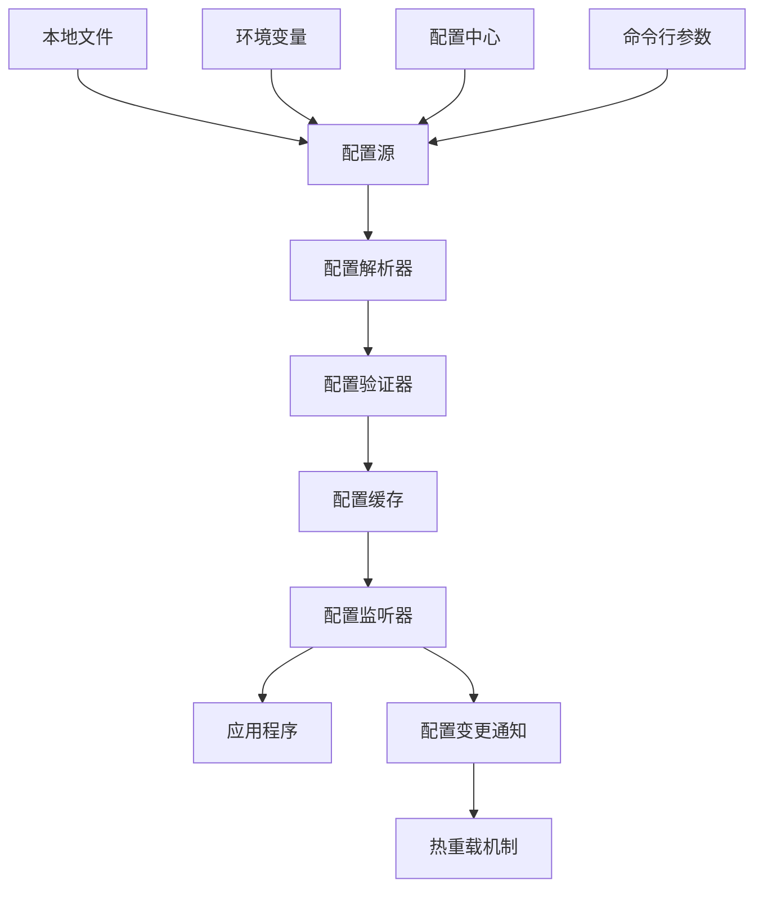

# 配置管理：构建灵活可控的系统配置架构

> 配置是系统的DNA，决定了应用的行为模式。本文从系统架构角度探讨Go配置管理生态，通过最佳实践和设计模式，构建可扩展、可观测的配置体系。

在微服务架构中，配置管理的复杂度呈指数级增长。从简单的环境变量到动态配置中心，从本地文件到分布式配置，如何设计一套既灵活又可控的配置系统，成为架构设计的关键挑战。

---

## 🏗️ 配置系统架构演进

### 配置管理的发展阶段

| 阶段 | 特征 | 适用场景 | 局限性 |
|------|------|----------|--------|
| **硬编码** | 配置写在代码中 | 简单demo | 需重新部署 |
| **配置文件** | 本地文件存储 | 单体应用 | 环境一致性差 |
| **环境变量** | 12-factor规范 | 容器化部署 | 复杂配置难管理 |
| **配置中心** | 集中化管理 | 微服务架构 | 增加系统复杂度 |
| **动态配置** | 实时配置更新 | 大规模分布式系统 | 一致性保证复杂 |

### 现代配置系统设计原则



---

## 🔧 主流配置库深度分析

### Viper：全能型配置解决方案

::: details Viper完整配置管理系统
```go
package config

import (
    "fmt"
    "log"
    "strings"
    "time"
    
    "github.com/spf13/viper"
    "github.com/fsnotify/fsnotify"
)

type Config struct {
    Server   ServerConfig   `mapstructure:"server"`
    Database DatabaseConfig `mapstructure:"database"`
    Redis    RedisConfig    `mapstructure:"redis"`
    Auth     AuthConfig     `mapstructure:"auth"`
    Logging  LoggingConfig  `mapstructure:"logging"`
}

type ServerConfig struct {
    Host         string        `mapstructure:"host" validate:"required"`
    Port         int           `mapstructure:"port" validate:"min=1,max=65535"`
    ReadTimeout  time.Duration `mapstructure:"read_timeout"`
    WriteTimeout time.Duration `mapstructure:"write_timeout"`
    TLS          TLSConfig     `mapstructure:"tls"`
}

type DatabaseConfig struct {
    Host            string `mapstructure:"host" validate:"required"`
    Port            int    `mapstructure:"port" validate:"min=1,max=65535"`
    Username        string `mapstructure:"username" validate:"required"`
    Password        string `mapstructure:"password" validate:"required"`
    Database        string `mapstructure:"database" validate:"required"`
    MaxOpenConns    int    `mapstructure:"max_open_conns" validate:"min=1"`
    MaxIdleConns    int    `mapstructure:"max_idle_conns" validate:"min=1"`
    ConnMaxLifetime time.Duration `mapstructure:"conn_max_lifetime"`
}

type ConfigManager struct {
    config   *Config
    viper    *viper.Viper
    watchers []ConfigWatcher
    validator ConfigValidator
}

type ConfigWatcher interface {
    OnConfigChange(config *Config)
}

func NewConfigManager() *ConfigManager {
    v := viper.New()
    
    // 设置配置文件搜索路径
    v.AddConfigPath("./configs")
    v.AddConfigPath("$HOME/.app")
    v.AddConfigPath("/etc/app/")
    
    // 设置配置文件名和类型
    v.SetConfigName("config")
    v.SetConfigType("yaml")
    
    // 环境变量前缀
    v.SetEnvPrefix("APP")
    v.AutomaticEnv()
    v.SetEnvKeyReplacer(strings.NewReplacer(".", "_"))
    
    // 设置默认值
    setDefaults(v)
    
    return &ConfigManager{
        viper:     v,
        watchers:  make([]ConfigWatcher, 0),
        validator: NewConfigValidator(),
    }
}

func setDefaults(v *viper.Viper) {
    // 服务器默认配置
    v.SetDefault("server.host", "0.0.0.0")
    v.SetDefault("server.port", 8080)
    v.SetDefault("server.read_timeout", "30s")
    v.SetDefault("server.write_timeout", "30s")
    
    // 数据库默认配置
    v.SetDefault("database.host", "localhost")
    v.SetDefault("database.port", 5432)
    v.SetDefault("database.max_open_conns", 25)
    v.SetDefault("database.max_idle_conns", 25)
    v.SetDefault("database.conn_max_lifetime", "5m")
    
    // 日志默认配置
    v.SetDefault("logging.level", "info")
    v.SetDefault("logging.format", "json")
}

func (cm *ConfigManager) Load() error {
    // 读取配置文件
    if err := cm.viper.ReadInConfig(); err != nil {
        if _, ok := err.(viper.ConfigFileNotFoundError); !ok {
            return fmt.Errorf("读取配置文件失败: %w", err)
        }
        log.Println("未找到配置文件，使用默认配置")
    }
    
    // 解析配置到结构体
    config := &Config{}
    if err := cm.viper.Unmarshal(config); err != nil {
        return fmt.Errorf("解析配置失败: %w", err)
    }
    
    // 验证配置
    if err := cm.validator.Validate(config); err != nil {
        return fmt.Errorf("配置验证失败: %w", err)
    }
    
    cm.config = config
    
    // 监听配置文件变化
    cm.viper.WatchConfig()
    cm.viper.OnConfigChange(func(e fsnotify.Event) {
        log.Printf("配置文件发生变化: %s", e.Name)
        cm.reloadConfig()
    })
    
    return nil
}

func (cm *ConfigManager) reloadConfig() {
    newConfig := &Config{}
    if err := cm.viper.Unmarshal(newConfig); err != nil {
        log.Printf("重新加载配置失败: %v", err)
        return
    }
    
    if err := cm.validator.Validate(newConfig); err != nil {
        log.Printf("新配置验证失败: %v", err)
        return
    }
    
    oldConfig := cm.config
    cm.config = newConfig
    
    // 通知所有监听器
    for _, watcher := range cm.watchers {
        go watcher.OnConfigChange(newConfig)
    }
    
    log.Printf("配置重新加载成功: %+v -> %+v", oldConfig, newConfig)
}

func (cm *ConfigManager) GetConfig() *Config {
    return cm.config
}

func (cm *ConfigManager) RegisterWatcher(watcher ConfigWatcher) {
    cm.watchers = append(cm.watchers, watcher)
}

// 动态更新配置
func (cm *ConfigManager) SetValue(key string, value interface{}) error {
    cm.viper.Set(key, value)
    return cm.reloadConfig()
}

// 获取配置值（支持热更新）
func (cm *ConfigManager) GetString(key string) string {
    return cm.viper.GetString(key)
}

func (cm *ConfigManager) GetInt(key string) int {
    return cm.viper.GetInt(key)
}

func (cm *ConfigManager) GetDuration(key string) time.Duration {
    return cm.viper.GetDuration(key)
}
```
:::

### 配置中心集成（Consul、etcd、Nacos）

::: details 分布式配置中心集成
```go
package configcenter

import (
    "context"
    "encoding/json"
    "fmt"
    "time"
    
    "github.com/hashicorp/consul/api"
    clientv3 "go.etcd.io/etcd/client/v3"
)

// 配置中心接口
type ConfigCenter interface {
    Get(key string) (string, error)
    Set(key, value string) error
    Watch(key string, callback func(string)) error
    Delete(key string) error
    Close() error
}

// Consul配置中心实现
type ConsulConfigCenter struct {
    client *api.Client
    kv     *api.KV
}

func NewConsulConfigCenter(address string) (*ConsulConfigCenter, error) {
    config := api.DefaultConfig()
    config.Address = address
    
    client, err := api.NewClient(config)
    if err != nil {
        return nil, err
    }
    
    return &ConsulConfigCenter{
        client: client,
        kv:     client.KV(),
    }, nil
}

func (c *ConsulConfigCenter) Get(key string) (string, error) {
    pair, _, err := c.kv.Get(key, nil)
    if err != nil {
        return "", err
    }
    
    if pair == nil {
        return "", fmt.Errorf("key %s not found", key)
    }
    
    return string(pair.Value), nil
}

func (c *ConsulConfigCenter) Set(key, value string) error {
    pair := &api.KVPair{
        Key:   key,
        Value: []byte(value),
    }
    
    _, err := c.kv.Put(pair, nil)
    return err
}

func (c *ConsulConfigCenter) Watch(key string, callback func(string)) error {
    go func() {
        var lastIndex uint64
        
        for {
            pair, meta, err := c.kv.Get(key, &api.QueryOptions{
                WaitIndex: lastIndex,
                WaitTime:  30 * time.Second,
            })
            
            if err != nil {
                time.Sleep(5 * time.Second)
                continue
            }
            
            if meta.LastIndex != lastIndex {
                lastIndex = meta.LastIndex
                if pair != nil {
                    callback(string(pair.Value))
                }
            }
        }
    }()
    
    return nil
}

func (c *ConsulConfigCenter) Delete(key string) error {
    _, err := c.kv.Delete(key, nil)
    return err
}

func (c *ConsulConfigCenter) Close() error {
    return nil
}

// etcd配置中心实现
type EtcdConfigCenter struct {
    client *clientv3.Client
}

func NewEtcdConfigCenter(endpoints []string) (*EtcdConfigCenter, error) {
    client, err := clientv3.New(clientv3.Config{
        Endpoints:   endpoints,
        DialTimeout: 5 * time.Second,
    })
    
    if err != nil {
        return nil, err
    }
    
    return &EtcdConfigCenter{client: client}, nil
}

func (e *EtcdConfigCenter) Get(key string) (string, error) {
    ctx, cancel := context.WithTimeout(context.Background(), 5*time.Second)
    defer cancel()
    
    resp, err := e.client.Get(ctx, key)
    if err != nil {
        return "", err
    }
    
    if len(resp.Kvs) == 0 {
        return "", fmt.Errorf("key %s not found", key)
    }
    
    return string(resp.Kvs[0].Value), nil
}

func (e *EtcdConfigCenter) Set(key, value string) error {
    ctx, cancel := context.WithTimeout(context.Background(), 5*time.Second)
    defer cancel()
    
    _, err := e.client.Put(ctx, key, value)
    return err
}

func (e *EtcdConfigCenter) Watch(key string, callback func(string)) error {
    go func() {
        watchChan := e.client.Watch(context.Background(), key)
        
        for watchResp := range watchChan {
            for _, event := range watchResp.Events {
                if event.Type == clientv3.EventTypePut {
                    callback(string(event.Kv.Value))
                }
            }
        }
    }()
    
    return nil
}

func (e *EtcdConfigCenter) Delete(key string) error {
    ctx, cancel := context.WithTimeout(context.Background(), 5*time.Second)
    defer cancel()
    
    _, err := e.client.Delete(ctx, key)
    return err
}

func (e *EtcdConfigCenter) Close() error {
    return e.client.Close()
}

// 统一配置管理器
type UnifiedConfigManager struct {
    center    ConfigCenter
    cache     map[string]string
    watchers  map[string][]func(string)
    validator ConfigValidator
}

func NewUnifiedConfigManager(center ConfigCenter) *UnifiedConfigManager {
    return &UnifiedConfigManager{
        center:    center,
        cache:     make(map[string]string),
        watchers:  make(map[string][]func(string)),
        validator: NewConfigValidator(),
    }
}

func (ucm *UnifiedConfigManager) GetConfig(key string, target interface{}) error {
    value, exists := ucm.cache[key]
    if !exists {
        var err error
        value, err = ucm.center.Get(key)
        if err != nil {
            return err
        }
        ucm.cache[key] = value
    }
    
    return json.Unmarshal([]byte(value), target)
}

func (ucm *UnifiedConfigManager) UpdateConfig(key string, value interface{}) error {
    jsonValue, err := json.Marshal(value)
    if err != nil {
        return err
    }
    
    // 验证配置
    if err := ucm.validator.ValidateJSON(string(jsonValue)); err != nil {
        return fmt.Errorf("配置验证失败: %w", err)
    }
    
    if err := ucm.center.Set(key, string(jsonValue)); err != nil {
        return err
    }
    
    ucm.cache[key] = string(jsonValue)
    return nil
}

func (ucm *UnifiedConfigManager) WatchConfig(key string, callback func(interface{})) error {
    ucm.watchers[key] = append(ucm.watchers[key], func(value string) {
        var config interface{}
        if err := json.Unmarshal([]byte(value), &config); err == nil {
            callback(config)
        }
    })
    
    return ucm.center.Watch(key, func(value string) {
        ucm.cache[key] = value
        for _, watcher := range ucm.watchers[key] {
            watcher(value)
        }
    })
}
```
:::

---

## 🔐 配置安全与验证

### 敏感信息加密存储

::: details 配置加密和密钥管理
```go
package security

import (
    "crypto/aes"
    "crypto/cipher"
    "crypto/rand"
    "crypto/sha256"
    "encoding/base64"
    "errors"
    "io"
    
    "golang.org/x/crypto/pbkdf2"
)

type ConfigEncryption struct {
    key []byte
    gcm cipher.AEAD
}

func NewConfigEncryption(password string, salt []byte) (*ConfigEncryption, error) {
    key := pbkdf2.Key([]byte(password), salt, 10000, 32, sha256.New)
    
    block, err := aes.NewCipher(key)
    if err != nil {
        return nil, err
    }
    
    gcm, err := cipher.NewGCM(block)
    if err != nil {
        return nil, err
    }
    
    return &ConfigEncryption{
        key: key,
        gcm: gcm,
    }, nil
}

func (ce *ConfigEncryption) Encrypt(plaintext string) (string, error) {
    nonce := make([]byte, ce.gcm.NonceSize())
    if _, err := io.ReadFull(rand.Reader, nonce); err != nil {
        return "", err
    }
    
    ciphertext := ce.gcm.Seal(nonce, nonce, []byte(plaintext), nil)
    return base64.StdEncoding.EncodeToString(ciphertext), nil
}

func (ce *ConfigEncryption) Decrypt(ciphertext string) (string, error) {
    data, err := base64.StdEncoding.DecodeString(ciphertext)
    if err != nil {
        return "", err
    }
    
    nonceSize := ce.gcm.NonceSize()
    if len(data) < nonceSize {
        return "", errors.New("ciphertext too short")
    }
    
    nonce, ciphertext := data[:nonceSize], data[nonceSize:]
    plaintext, err := ce.gcm.Open(nil, nonce, ciphertext, nil)
    if err != nil {
        return "", err
    }
    
    return string(plaintext), nil
}

// 安全配置管理器
type SecureConfigManager struct {
    *ConfigManager
    encryption *ConfigEncryption
    keyResolver KeyResolver
}

type KeyResolver interface {
    ResolveKey(keyID string) ([]byte, error)
}

func NewSecureConfigManager(encryption *ConfigEncryption) *SecureConfigManager {
    return &SecureConfigManager{
        ConfigManager: NewConfigManager(),
        encryption:    encryption,
    }
}

func (scm *SecureConfigManager) GetSecureString(key string) (string, error) {
    encryptedValue := scm.viper.GetString(key)
    return scm.encryption.Decrypt(encryptedValue)
}

func (scm *SecureConfigManager) SetSecureString(key, value string) error {
    encryptedValue, err := scm.encryption.Encrypt(value)
    if err != nil {
        return err
    }
    
    scm.viper.Set(key, encryptedValue)
    return nil
}

// 配置掩码处理
func MaskSensitiveConfig(config map[string]interface{}) map[string]interface{} {
    sensitiveKeys := []string{
        "password", "secret", "token", "key", "credential",
        "api_key", "private_key", "cert", "auth",
    }
    
    masked := make(map[string]interface{})
    for k, v := range config {
        if containsSensitiveKey(k, sensitiveKeys) {
            masked[k] = "***MASKED***"
        } else if subMap, ok := v.(map[string]interface{}); ok {
            masked[k] = MaskSensitiveConfig(subMap)
        } else {
            masked[k] = v
        }
    }
    
    return masked
}

func containsSensitiveKey(key string, sensitiveKeys []string) bool {
    keyLower := strings.ToLower(key)
    for _, sensitive := range sensitiveKeys {
        if strings.Contains(keyLower, sensitive) {
            return true
        }
    }
    return false
}
```
:::

### 配置验证与约束

::: details 完整的配置验证系统
```go
package validation

import (
    "fmt"
    "reflect"
    "regexp"
    "strconv"
    "strings"
    
    "github.com/go-playground/validator/v10"
)

type ConfigValidator struct {
    validator *validator.Validate
    rules     map[string]ValidationRule
}

type ValidationRule struct {
    Required    bool
    Type        string
    Pattern     *regexp.Regexp
    Range       *RangeValidator
    Custom      func(interface{}) error
}

type RangeValidator struct {
    Min interface{}
    Max interface{}
}

func NewConfigValidator() ConfigValidator {
    v := validator.New()
    
    // 注册自定义验证器
    v.RegisterValidation("port", validatePort)
    v.RegisterValidation("duration", validateDuration)
    v.RegisterValidation("url", validateURL)
    
    return ConfigValidator{
        validator: v,
        rules:     make(map[string]ValidationRule),
    }
}

func (cv *ConfigValidator) Validate(config interface{}) error {
    // 使用struct tag验证
    if err := cv.validator.Struct(config); err != nil {
        return cv.formatValidationError(err)
    }
    
    // 使用自定义规则验证
    return cv.validateWithRules(config)
}

func (cv *ConfigValidator) AddRule(path string, rule ValidationRule) {
    cv.rules[path] = rule
}

func (cv *ConfigValidator) validateWithRules(config interface{}) error {
    configMap := structToMap(config)
    
    for path, rule := range cv.rules {
        value, exists := getValueByPath(configMap, path)
        
        if !exists && rule.Required {
            return fmt.Errorf("required config missing: %s", path)
        }
        
        if exists {
            if err := cv.validateValue(value, rule, path); err != nil {
                return err
            }
        }
    }
    
    return nil
}

func (cv *ConfigValidator) validateValue(value interface{}, rule ValidationRule, path string) error {
    // 类型验证
    if rule.Type != "" {
        if !cv.checkType(value, rule.Type) {
            return fmt.Errorf("config %s: expected type %s, got %T", path, rule.Type, value)
        }
    }
    
    // 正则验证
    if rule.Pattern != nil {
        str := fmt.Sprintf("%v", value)
        if !rule.Pattern.MatchString(str) {
            return fmt.Errorf("config %s: value %s doesn't match pattern", path, str)
        }
    }
    
    // 范围验证
    if rule.Range != nil {
        if err := cv.validateRange(value, rule.Range, path); err != nil {
            return err
        }
    }
    
    // 自定义验证
    if rule.Custom != nil {
        if err := rule.Custom(value); err != nil {
            return fmt.Errorf("config %s: %w", path, err)
        }
    }
    
    return nil
}

func (cv *ConfigValidator) checkType(value interface{}, expectedType string) bool {
    switch expectedType {
    case "string":
        _, ok := value.(string)
        return ok
    case "int":
        _, ok := value.(int)
        return ok
    case "float":
        _, ok := value.(float64)
        return ok
    case "bool":
        _, ok := value.(bool)
        return ok
    default:
        return true
    }
}

func (cv *ConfigValidator) validateRange(value interface{}, rangeVal *RangeValidator, path string) error {
    switch v := value.(type) {
    case int:
        if rangeVal.Min != nil {
            if min, ok := rangeVal.Min.(int); ok && v < min {
                return fmt.Errorf("config %s: value %d is less than minimum %d", path, v, min)
            }
        }
        if rangeVal.Max != nil {
            if max, ok := rangeVal.Max.(int); ok && v > max {
                return fmt.Errorf("config %s: value %d is greater than maximum %d", path, v, max)
            }
        }
    case float64:
        if rangeVal.Min != nil {
            if min, ok := rangeVal.Min.(float64); ok && v < min {
                return fmt.Errorf("config %s: value %f is less than minimum %f", path, v, min)
            }
        }
        if rangeVal.Max != nil {
            if max, ok := rangeVal.Max.(float64); ok && v > max {
                return fmt.Errorf("config %s: value %f is greater than maximum %f", path, v, max)
            }
        }
    }
    
    return nil
}

// 自定义验证函数
func validatePort(fl validator.FieldLevel) bool {
    port := fl.Field().Int()
    return port > 0 && port <= 65535
}

func validateDuration(fl validator.FieldLevel) bool {
    duration := fl.Field().String()
    _, err := time.ParseDuration(duration)
    return err == nil
}

func validateURL(fl validator.FieldLevel) bool {
    url := fl.Field().String()
    _, err := url.Parse(url)
    return err == nil
}

func (cv *ConfigValidator) formatValidationError(err error) error {
    var messages []string
    
    for _, err := range err.(validator.ValidationErrors) {
        field := err.Field()
        tag := err.Tag()
        
        switch tag {
        case "required":
            messages = append(messages, fmt.Sprintf("%s is required", field))
        case "min":
            messages = append(messages, fmt.Sprintf("%s must be at least %s", field, err.Param()))
        case "max":
            messages = append(messages, fmt.Sprintf("%s must be at most %s", field, err.Param()))
        case "port":
            messages = append(messages, fmt.Sprintf("%s must be a valid port number", field))
        case "duration":
            messages = append(messages, fmt.Sprintf("%s must be a valid duration", field))
        default:
            messages = append(messages, fmt.Sprintf("%s failed validation: %s", field, tag))
        }
    }
    
    return fmt.Errorf("validation failed: %s", strings.Join(messages, "; "))
}

// 配置验证规则示例
func SetupValidationRules(validator ConfigValidator) {
    // 服务器配置规则
    validator.AddRule("server.port", ValidationRule{
        Required: true,
        Type:     "int",
        Range:    &RangeValidator{Min: 1024, Max: 65535},
    })
    
    // 数据库配置规则
    validator.AddRule("database.host", ValidationRule{
        Required: true,
        Type:     "string",
        Pattern:  regexp.MustCompile(`^[a-zA-Z0-9.-]+$`),
    })
    
    // 自定义业务规则
    validator.AddRule("app.max_workers", ValidationRule{
        Required: true,
        Type:     "int",
        Custom: func(value interface{}) error {
            workers := value.(int)
            if workers > runtime.NumCPU()*2 {
                return fmt.Errorf("max_workers should not exceed 2x CPU count")
            }
            return nil
        },
    })
}
```
:::

---

## 📊 配置治理与监控

### 配置变更审计

::: details 配置变更跟踪和审计系统
```go
package audit

import (
    "encoding/json"
    "time"
)

type ConfigAuditLog struct {
    ID        string                 `json:"id"`
    Timestamp time.Time              `json:"timestamp"`
    User      string                 `json:"user"`
    Action    string                 `json:"action"` // CREATE, UPDATE, DELETE
    Key       string                 `json:"key"`
    OldValue  interface{}            `json:"old_value,omitempty"`
    NewValue  interface{}            `json:"new_value,omitempty"`
    Source    string                 `json:"source"` // API, FILE, ENV
    Metadata  map[string]interface{} `json:"metadata"`
}

type ConfigAuditor struct {
    storage AuditStorage
    hooks   []AuditHook
}

type AuditStorage interface {
    Store(log ConfigAuditLog) error
    Query(filter AuditFilter) ([]ConfigAuditLog, error)
}

type AuditHook interface {
    OnConfigChange(log ConfigAuditLog)
}

type AuditFilter struct {
    User      string
    Key       string
    Action    string
    StartTime time.Time
    EndTime   time.Time
    Limit     int
}

func NewConfigAuditor(storage AuditStorage) *ConfigAuditor {
    return &ConfigAuditor{
        storage: storage,
        hooks:   make([]AuditHook, 0),
    }
}

func (ca *ConfigAuditor) LogChange(user, action, key string, oldValue, newValue interface{}, source string) {
    log := ConfigAuditLog{
        ID:        generateID(),
        Timestamp: time.Now(),
        User:      user,
        Action:    action,
        Key:       key,
        OldValue:  oldValue,
        NewValue:  newValue,
        Source:    source,
        Metadata:  make(map[string]interface{}),
    }
    
    // 存储审计日志
    if err := ca.storage.Store(log); err != nil {
        // 记录错误但不影响配置操作
        fmt.Printf("Failed to store audit log: %v\n", err)
    }
    
    // 触发钩子
    for _, hook := range ca.hooks {
        go hook.OnConfigChange(log)
    }
}

func (ca *ConfigAuditor) AddHook(hook AuditHook) {
    ca.hooks = append(ca.hooks, hook)
}

func (ca *ConfigAuditor) QueryChanges(filter AuditFilter) ([]ConfigAuditLog, error) {
    return ca.storage.Query(filter)
}

// 配置监控指标
type ConfigMetrics struct {
    ChangeCount    map[string]int64
    ErrorCount     int64
    LastChangeTime time.Time
    ConfigSize     map[string]int
}

func (cm *ConfigMetrics) RecordChange(key string) {
    if cm.ChangeCount == nil {
        cm.ChangeCount = make(map[string]int64)
    }
    cm.ChangeCount[key]++
    cm.LastChangeTime = time.Now()
}

func (cm *ConfigMetrics) RecordError() {
    cm.ErrorCount++
}

func (cm *ConfigMetrics) RecordSize(key string, size int) {
    if cm.ConfigSize == nil {
        cm.ConfigSize = make(map[string]int)
    }
    cm.ConfigSize[key] = size
}

// 配置健康检查
type ConfigHealthChecker struct {
    validators map[string]func() error
    metrics    *ConfigMetrics
}

func NewConfigHealthChecker() *ConfigHealthChecker {
    return &ConfigHealthChecker{
        validators: make(map[string]func() error),
        metrics:    &ConfigMetrics{},
    }
}

func (chc *ConfigHealthChecker) AddValidator(name string, validator func() error) {
    chc.validators[name] = validator
}

func (chc *ConfigHealthChecker) CheckHealth() map[string]error {
    results := make(map[string]error)
    
    for name, validator := range chc.validators {
        if err := validator(); err != nil {
            results[name] = err
            chc.metrics.RecordError()
        }
    }
    
    return results
}
```
:::

---

## 🎯 配置管理最佳实践

### 选择决策树

```
配置库选择指南
├── 需要复杂配置源支持？
│   ├── 是 → Viper（支持文件、环境变量、远程配置中心）
│   └── 否 → 继续评估
├── 只需环境变量？
│   ├── 是 → envconfig或godotenv
│   └── 否 → 继续评估  
├── 需要动态配置？
│   ├── 是 → 配置中心方案（Consul、etcd、Nacos）
│   └── 否 → 简单文件配置
└── 性能要求极高？
    └── 是 → 自定义配置解决方案
```

### 配置管理检查清单

✅ **配置设计**：
- [ ] 明确的配置层次结构
- [ ] 环境特定的配置隔离
- [ ] 敏感配置加密存储
- [ ] 配置验证和约束
- [ ] 默认值合理设置

✅ **运维管理**：
- [ ] 配置变更审计日志
- [ ] 配置版本控制
- [ ] 灰度配置发布
- [ ] 配置回滚机制
- [ ] 监控和告警

✅ **安全考虑**：
- [ ] 敏感信息加密
- [ ] 访问权限控制
- [ ] 配置传输加密
- [ ] 审计和合规
- [ ] 密钥轮换策略

**最终建议**：
- **简单应用**：Viper + 文件配置
- **微服务架构**：配置中心 + Viper
- **企业级系统**：完整的配置治理体系

配置管理的核心是**可控性**和**可观测性**。选择合适的工具只是第一步，建立完善的配置治理流程和监控体系才是关键。
