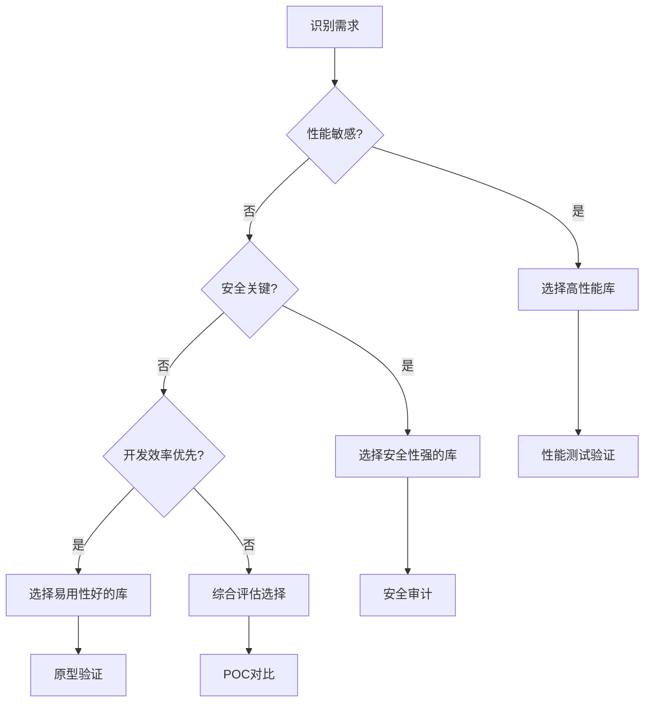

# 常用库 Libraries

> Go生态中的精选工具库，从性能优化到安全防护的工程实践指南。

在Go的世界里，"少即是多"的设计哲学并不意味着重复造轮子。选择合适的第三方库，往往能在保持代码简洁的同时，获得企业级的功能和性能。本模块深入分析Go生态中最重要的工具库，通过技术原理、性能测试和安全实践，为你提供深度的选型指南。

---

## 📦 库分类与特色

### [HTTP客户端库](/ecosystem/libraries/http-clients)
**特色风格**：🏆 实战对比 + 性能基准测试

深入对比net/http、Resty、Fasthttp等主流HTTP客户端，通过真实的QPS测试、内存分配分析揭示性能差异。包含微服务内部调用、第三方API集成、高性能网关等典型场景的最佳实践。

**核心价值**：用数据说话，让你的HTTP客户端选择有理有据。

---

### [序列化库](/ecosystem/libraries/serialization)
**特色风格**：🔬 深度技术剖析 + 协议原理解析

从JSON到Protocol Buffers，深入分析各种序列化协议的底层原理、内存分配特征和性能表现。通过内存profiling和基准测试，揭示序列化性能的技术内幕。

**核心价值**：理解序列化的技术本质，在性能和复杂度间找到最佳平衡。

---

### [安全库](/ecosystem/libraries/security)
**特色风格**：🛡️ 威胁建模 + 安全最佳实践

从威胁模型出发，深入分析密码学、身份认证、输入验证等安全关键点。结合OWASP Top 10和真实漏洞案例，提供企业级安全防护方案。

**核心价值**：构建安全防线，让你的应用经得起真实世界的考验。

---

### [日志库](/ecosystem/libraries/logging)
**特色风格**：📊 工程治理 + 可观测性集成

从日志设计理念出发，对比Logrus、Zap、Zerolog等主流日志库的性能和功能。重点关注结构化日志、性能开销、监控集成等生产环境关键需求。

**核心价值**：建立完整的日志体系，让应用的运行状态一目了然。

---

### [配置管理](/ecosystem/libraries/configuration)
**特色风格**：🏗️ 架构设计 + 配置治理

从配置架构设计角度分析Viper等配置管理方案。涵盖配置分层、环境隔离、动态更新、安全存储等企业级配置管理需求。

**核心价值**：建立规范的配置管理体系，支撑复杂应用的配置需求。

---

## 🎯 选型策略框架

### 性能导向选择

```go
// 高性能场景技术栈推荐
高并发HTTP服务:
  客户端: Fasthttp
  序列化: Protocol Buffers  
  日志: Zap
  
大数据处理:
  序列化: MessagePack/Avro
  日志: 结构化JSON
  配置: 环境变量
```

### 开发效率导向

```go
// 快速开发场景技术栈推荐
快速原型:
  客户端: Resty
  序列化: JSON (JSONiter)
  日志: Logrus
  配置: Viper
  
团队协作:
  统一标准: 制定库选择规范
  文档完善: 选择文档友好的库
  学习成本: 优先选择团队熟悉的技术
```

### 企业级导向

```go
// 企业级应用技术栈推荐
大型系统:
  安全: 完整的认证授权体系
  监控: 结构化日志 + 指标收集
  配置: 集中化配置管理
  
合规要求:
  数据保护: 加密传输和存储
  审计跟踪: 完整的操作日志
  安全防护: 输入验证 + 权限控制
```

---

## 📊 技术选型维度

### 核心评估指标

| 维度 | 权重 | 评估要点 | 示例库对比 |
|------|------|----------|------------|
| **性能表现** | 🔴 高 | 吞吐量、延迟、内存占用 | Fasthttp vs net/http |
| **安全性** | 🔴 高 | 漏洞历史、安全特性 | bcrypt vs MD5 |
| **开发体验** | 🟠 中 | API设计、文档质量 | Resty vs 原生实现 |
| **生态成熟度** | 🟠 中 | 社区活跃度、版本稳定性 | Logrus vs 新兴日志库 |
| **维护成本** | 🟡 低 | 学习曲线、依赖复杂度 | Viper vs 自建配置 |

### 决策流程



---

## 🔧 库集成最佳实践

### 依赖管理策略

```go
// go.mod 依赖版本管理
module your-project

require (
    github.com/gin-gonic/gin v1.9.1        // Web框架
    github.com/go-resty/resty/v2 v2.7.0    // HTTP客户端
    github.com/sirupsen/logrus v1.9.3      // 日志库
    github.com/spf13/viper v1.16.0         // 配置管理
    golang.org/x/crypto v0.12.0            // 加密库
)

// 固定版本，避免意外升级
replace github.com/example/lib => github.com/example/lib v1.2.3
```

### 统一封装策略

```go
// 库的统一封装，便于后续替换
package infrastructure

// HTTP客户端接口
type HTTPClient interface {
    Get(url string) (*Response, error)
    Post(url string, body interface{}) (*Response, error)
}

// 日志接口
type Logger interface {
    Info(msg string, fields ...Field)
    Error(msg string, err error, fields ...Field)
}

// 配置接口
type Config interface {
    Get(key string) interface{}
    GetString(key string) string
    GetInt(key string) int
}
```

### 性能监控集成

```go
// 库性能监控
import "github.com/prometheus/client_golang/prometheus"

var (
    httpClientDuration = prometheus.NewHistogramVec(
        prometheus.HistogramOpts{
            Name: "http_client_duration_seconds",
            Help: "HTTP client request duration",
        },
        []string{"method", "status"},
    )
    
    serializationDuration = prometheus.NewHistogramVec(
        prometheus.HistogramOpts{
            Name: "serialization_duration_seconds", 
            Help: "Serialization operation duration",
        },
        []string{"operation", "format"},
    )
)
```

---

## 🚀 库升级与演进

### 版本升级策略

**谨慎升级原则**：
1. **主版本升级**：充分测试，评估破坏性变更
2. **次版本升级**：关注新功能，评估收益
3. **补丁版本升级**：优先安全补丁

**升级检查清单**：
- [ ] 查看CHANGELOG和破坏性变更
- [ ] 在测试环境完整验证
- [ ] 性能基准测试对比
- [ ] 安全漏洞扫描
- [ ] 向后兼容性测试

### 库替换策略

```go
// 库替换的渐进式策略
type LibraryAdapter struct {
    oldImpl OldLibrary
    newImpl NewLibrary
    migration bool
}

func (la *LibraryAdapter) Process(data interface{}) error {
    if la.migration {
        // 双写验证，确保新库正确性
        oldResult := la.oldImpl.Process(data)
        newResult := la.newImpl.Process(data)
        
        if !compareResults(oldResult, newResult) {
            log.Warn("Library migration result mismatch")
        }
        
        return newResult
    }
    
    return la.oldImpl.Process(data)
}
```

---

**选择建议**：技术选型是一门平衡的艺术。没有完美的库，只有最适合当前场景的方案。始终从业务需求出发，在性能、安全、可维护性之间找到最佳平衡点。

记住：**库是工具，不是目的。选择能够解决问题、提升效率的工具，而不是最新最酷的技术。** 