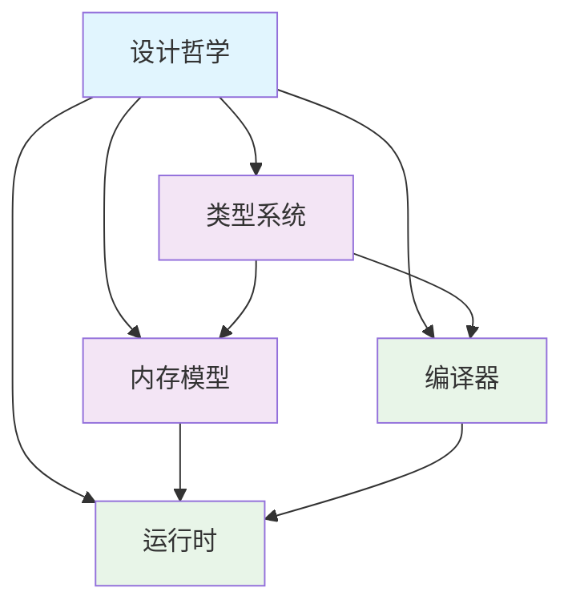

# 核心概念：思想的源泉

> 学会语法只是开始，理解思想才是精通的门径。Go 不仅仅是一门编程语言，更是一套关于软件构建的哲学体系。当您领悟了这套思想，您就能够编写出真正"地道"的 Go 代码。

## 从技能到智慧的跃迁

很多人学习编程语言的方式是记忆语法、掌握特性、练习技巧。但这种方式有一个根本问题：**它把语言当作工具，而忽略了语言背后的思想**。

真正的精通来自于理解设计者的思维过程。当您明白了"为什么 Go 要这样设计"，您就能在任何情况下都做出符合 Go 哲学的决策。

### 思维模式的转换

Go 要求我们重新思考编程的本质：

```go
// 这不仅仅是语法，更是一种思维方式
if err != nil {
    return err
}
```

这短短几行代码体现了 Go 的核心哲学：**显式优于隐式，清晰优于聪明**。它迫使我们正视错误，而不是假装错误不存在。

## 设计哲学的五个维度

### [设计哲学：重新定义简单](/learn/concepts/philosophy)

> "简单可以更难实现，因为您必须努力清理思维才能使其简单。但最终这是值得的，因为一旦到达那里，您就可以移山。" —— Steve Jobs

Go 的简单不是贫乏，而是**经过提炼的纯粹**。它问的不是"我们能添加什么特性"，而是"我们能移除什么复杂性"。

**深层思考：**
- 为什么"少即是多"在软件设计中如此重要？
- 认知负荷如何影响代码质量？
- 约定如何释放创造力？
- 简单的表面下隐藏着怎样的深度？

这种哲学将改变您对软件设计的根本认知。

### [类型系统：表达意图的语言](/learn/concepts/type-system)

> 类型不是约束，而是表达意图的工具。优秀的类型系统让不可能的状态变得无法表示。

Go 的类型系统体现了一种平衡艺术：**足够严格以捕获错误，足够灵活以表达复杂思想**。它不是学术练习，而是实用工具。

**核心洞察：**
- 类型如何成为最好的文档？
- 编译时约束如何释放运行时自由？
- 组合如何超越继承？
- 接口如何解耦依赖关系？

理解类型系统将让您的代码变得自证明。

### [内存模型：并发世界的契约](/learn/concepts/memory-model)

> 在并发的世界里，时间不再是线性的。内存模型定义了这个混沌世界中的秩序规则。

内存模型听起来技术性很强，但它实际上是关于**程序员与计算机之间的协议**：您遵循某些规则，计算机保证某些行为。

**深度理解：**
- 为什么在并发中"先发生"不等于"先看到"？
- 如何在多核心世界中建立因果关系？
- channel 如何优雅地解决同步问题？
- 什么时候需要显式同步，什么时候依赖语言保证？

这是编写正确并发程序的理论基础。

### [编译器：代码转换的艺术](/learn/concepts/compiler)

> 编译器不仅是翻译器，更是您的合作伙伴。理解它的工作方式，就能编写出它更容易优化的代码。

Go 的编译器体现了**实用主义的优化哲学**：不追求理论上的最优，但保证实际上的高效。

**编译器思维：**
- 如何与编译器"对话"，暗示优化机会？
- 逃逸分析如何影响程序的内存布局？
- 内联决策如何平衡代码大小与执行速度？
- 编译时计算如何减少运行时开销？

与编译器协作将显著提升程序性能。

### [运行时：幕后的管家](/learn/concepts/runtime)

> 运行时系统是 Go 简洁性的秘密武器。它在背后处理复杂性，让前台的代码保持优雅。

Go 的运行时不是重负担，而是**复杂性的避雷针**。它承担了内存管理、调度、垃圾回收等复杂任务，让程序员专注于业务逻辑。

**运行时智慧：**
- 调度器如何让成千上万的 goroutine 协调工作？
- 垃圾回收器如何在回收内存和保持性能之间平衡？
- 反射机制如何在运行时提供编译时的信息？
- 如何与运行时协作而不是对抗？

理解运行时将让您编写出与系统和谐共舞的代码。

## 概念之间的有机联系

这五个概念不是孤立的知识点，而是相互支撑的思想体系：



- **设计哲学**是根基，影响所有其他设计
- **类型系统**体现哲学，指导编译器优化
- **内存模型**定义并发规则，影响运行时行为
- **编译器**实现类型检查，生成运行时代码
- **运行时**执行内存模型，支持类型系统

## 学习方法：从原理到实践

### 1. 哲学先行

不要急于学习语法细节，先理解设计动机：
- 这个特性解决什么问题？
- 为什么选择这种解决方案？
- 有哪些权衡和考量？

### 2. 概念建模

用概念模型来理解语言特性：
- 接口是什么？是契约，是抽象边界
- goroutine 是什么？是用户态线程，是并发抽象
- channel 是什么？是通信管道，是同步机制

### 3. 实验验证

通过代码实验验证理解：

```go
// 验证接口的隐式实现
type Writer interface {
    Write([]byte) (int, error)
}

// os.File 自动实现了 Writer，无需声明
var w Writer = os.Stdout
w.Write([]byte("Hello, interfaces!"))
```

### 4. 反思总结

每学完一个概念，问自己：
- 这改变了我的哪些认知？
- 如何应用到实际编程中？
- 与其他概念有什么联系？

## 超越 Go 的价值

理解 Go 的核心概念，获得的不仅是 Go 编程技能，更是：

### 系统思维
- 如何平衡复杂性和简单性
- 如何设计约束来释放创造力
- 如何在组件间建立清晰的边界

### 工程智慧
- 显式优于隐式的价值
- 组合优于继承的威力
- 约定优于配置的效率

### 设计哲学
- 少即是多的深刻含义
- 实用主义的设计方法
- 人类友好的技术选择

这些思想将伴随您的整个技术生涯，在任何语言和项目中都有价值。

## 开始思想之旅

准备好重新审视编程了吗？让我们从[设计哲学](/learn/concepts/philosophy)开始，深入 Go 的思想内核。记住，我们学习的不仅是一门语言，更是一种思考方式。

在这个旅程中，您将发现：代码不仅仅是机器指令，更是人类思想的表达；编程不仅仅是解决问题，更是设计优雅的解决方案；技术不仅仅是工具，更是改变世界的思想力量。 