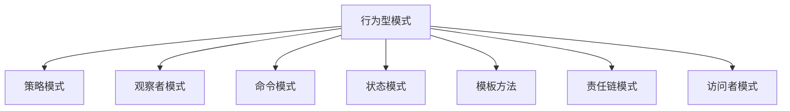

---

title: 行为型模式（Behavioral Patterns）
outline: deep
-------------

# 行为型模式

::: tip
**行为型模式**关注对象间的通信与职责分配。在 Go 中，接口 + 函数 + 并发原语赋予它们极高的表达力与实现灵活性。
:::

## 为什么 Go 的行为型模式如此灵活？

Go 不需要“继承树”，它更偏爱函数和接口组合。

::: details 示例：Go 中的策略模式
```go
// Go 中的策略模式

// 函数式策略
sortFunc := func(data []int) []int {
    sort.Ints(data)
    return data
}

// 或接口式策略
interface Sorter {
    Sort([]int) []int
}
```
:::
🧠 特性概览：

* 函数即策略、命令、模板方法等
* 接口 + goroutine 实现观察者、责任链等
* channel + select 天然支持事件与状态切换

---

## 模式全景图



---

## 🎯 策略模式（Strategy）

定义一组算法，将其封装并且可互换。

::: details 示例：Go 中的策略模式
```go
// 函数策略
sortFunc := func(data []int) []int {
    sort.Ints(data)
    return data
}

// 使用
result := sortFunc([]int{5, 2, 3})
```
:::
适用：

* 算法可互换（排序、支付、编码器）
* 封装行为切换逻辑

---

## 👁️ 观察者模式（Observer）

一对多依赖关系，状态变更时自动通知。

::: details 示例：观察者模式
```go
bus := NewEventBus()
bus.Subscribe("log", Logger{})
bus.Publish(UserCreated, data)
```
:::
适用：

* 事件系统（如用户通知）
* 插件系统（热插拔）
* 微服务消息广播

---

## ⚡ 命令模式（Command）

将操作请求封装为命令对象，可记录、撤销、重放。

::: details 示例：命令模式
```go
cmd := CreateFile("file.txt")
invoker.Execute(cmd)
invoker.Undo()
```
:::
适用：

* 可撤销操作（文本编辑器）
* 宏命令、队列、日志
* 批量操作封装

---

## 🌀 状态模式（State）

对象行为取决于其内部状态，每个状态封装一组行为。

::: details 示例：状态模式
```go
fsm := NewOrderFSM()
fsm.Trigger("pay") // 状态从 Pending -> Paid
```
:::
适用：

* 状态驱动系统（订单、流程）
* 状态图清晰建模

---

## 📋 模板方法模式（Template Method）

定义算法骨架，将某些步骤延迟到子类实现。

::: details 示例：模板方法模式
```go
type Job interface {
    Prepare()
    Execute()
    Finish()
}

func RunJob(j Job) {
    j.Prepare()
    j.Execute()
    j.Finish()
}
```
:::
适用：

* 统一流程、多种实现
* 建立编排逻辑和步骤清晰度

---

## 🔗 责任链模式（Chain of Responsibility）

多个对象按顺序处理请求，类似中间件链：

::: details 示例：责任链模式
```go
handler := Logger(Auth(Router(final)))
handler.ServeHTTP(w, r)
```
:::
适用：

* HTTP 中间件
* 日志处理链、消息过滤器

---

## 👣 访问者模式（Visitor）

为对象结构增加新操作，无需修改原有结构。

::: details 示例：访问者模式
```go
// 访问者接口
interface Visitor {
    VisitFile(f File)
    VisitFolder(f Folder)
}

// 元素结构
interface Node {
    Accept(v Visitor)
}
```
:::
适用：

* AST 遍历
* 数据导出（如 XML/JSON）
* 新功能插入既有结构

---

## ✅ 模式选型参考

| 场景           | 推荐模式   |
| ------------ | ------ |
| 多种行为切换       | 策略模式   |
| 状态驱动 / 有限状态机 | 状态模式   |
| 请求可撤销 / 重做   | 命令模式   |
| 通知多个监听方      | 观察者模式  |
| 有顺序处理器       | 责任链模式  |
| 固定骨架 + 可插入步骤 | 模板方法模式 |
| 多种操作跨结构统一访问  | 访问者模式  |

---

## 💡 行为型模式心法

1. **函数优先**：函数是策略、命令、模板的天然选择
2. **接口最小化**：用接口解耦职责，只暴露必要行为
3. **组合优于继承**：接口 + struct 组合代替类继承
4. **关注变化的方向**：行为变化 → 策略；状态变化 → 状态机
5. **与并发结合思考**：观察者 + channel / 责任链 + goroutine

---

📘 推荐继续阅读：[并发模式](/practice/patterns/concurrency)，学习 Go 原生的并发设计范式。
