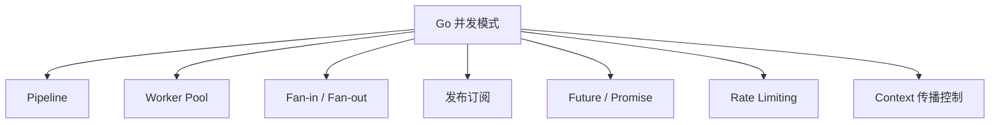

---

title: 并发模式（Concurrency Patterns）
outline: deep
-------------

# 并发模式

::: tip
**并发是 Go 的 DNA。** goroutine 和 channel 让并发编程变得简单而强大，同时避免了传统语言中常见的锁竞争与资源同步困境。
:::

## 为什么 Go 的并发如此特别？

> "不要通过共享内存来通信，而应该通过通信来共享内存。"

Go 推崇以通信代替共享内存。与传统锁机制相比，它的原生并发构建块 goroutine 和 channel 提供了更安全、更直观的方式来组织并发逻辑。

### 直观对比

::: details 示例：直观对比
```go
// ❌ 使用共享内存（传统并发）
mutex.Lock()
counter++
mutex.Unlock()

// ✅ 使用 channel（Go 风格）
ch <- 1 // 通过消息传递改变状态
```
:::
### 特点总结

* **轻量级 goroutine**：调度器管理，百万并发无压力
* **channel 通信**：避免锁，类型安全
* **select 语句**：多路复用通信场景
* **context 包**：生命周期管理成为并发代码标配

---

## 并发模式全景图



---

## 🔄 Pipeline 模式

将处理过程分为多个阶段，每一阶段运行在独立 goroutine 中，通过 channel 串联：

::: details 示例：Pipeline 模式
```go
numbers := generate(ctx, 10)
squares := square(ctx, numbers)
evens := filterEven(ctx, squares)
```
:::
✅ 特别适合：

* 分布式任务流水线
* 数据清洗与 ETL 场景
* 可组合、易取消、易调试

---

## 👥 Worker Pool 模式

固定数量的 goroutine（worker）从任务队列中消费任务，适合高并发批量处理：

::: details 示例：Worker Pool 模式
```go
pool := NewWorkerPool(4)
pool.Submit(task)
```
:::
适用：

* 消息消费系统（如 Kafka consumer）
* 批处理作业调度
* 限制并发度场景

---

## 🔀 Fan-in / Fan-out 模式

* **Fan-out**：将任务广播给多个 worker 并发处理
* **Fan-in**：将多个 channel 合并为一个，统一处理结果

用途：

* 提高处理吞吐
* 动态扩展 goroutine 数量
* 聚合分布式结果

---

## 📡 发布订阅模式

事件驱动设计中的核心模式，通过广播机制实现“生产者-订阅者”解耦：

::: details 示例：发布订阅模式
```go
bus.Publish(UserCreated, data)
bus.Subscribe(subscriber)
```
:::
典型场景：

* 用户行为通知
* 微服务之间事件通信
* 插件机制实现

---

## ⏱️ Rate Limiting 模式

控制系统速率的关键机制。常用算法包括：

* **令牌桶（Token Bucket）**
* **滑动窗口（Sliding Window）**
* **分布式限流器（Redis / etcd）**

::: details 示例：Rate Limiting 模式
```go
if limiter.Allow() {
    // 执行操作
} else {
    // 返回 429
}
```
:::
适用：

* 接口限流、突发流控
* 防刷、防爬机制

---

## ⛓️ Context 模式

用来传递取消信号、超时控制和请求范围数据，是现代 Go 并发的基石。

::: details 示例：Context 模式
```go
ctx, cancel := context.WithTimeout(context.Background(), 2*time.Second)
defer cancel()
```
:::
适用：

* HTTP 请求生命周期
* 服务链路追踪
* 并发任务取消控制

---

## ✅ 实践建议汇总

| 目标      | 推荐模式             |
| ------- | ---------------- |
| 数据流处理   | Pipeline         |
| 并发任务调度  | Worker Pool      |
| 并行 + 聚合 | Fan-out / Fan-in |
| 事件驱动架构  | 发布订阅             |
| 接口速率控制  | Rate Limiting    |
| 生命周期管理  | Context          |

---

## 💡 并发模式心法

1. **Context 优先**：贯穿所有 goroutine 生命周期
2. **优雅退出**：`cancel()` + `WaitGroup`
3. **错误传递机制清晰**：封装错误信道或使用结构体包装结果
4. **避免资源泄露**：关闭 channel / 控制 goroutine 生命周期
5. **组合比继承更重要**：鼓励小模式组合大系统

---

📘 推荐继续阅读：[行为型模式](/practice/patterns/behavioral)，深入了解对象间如何通信协作。
