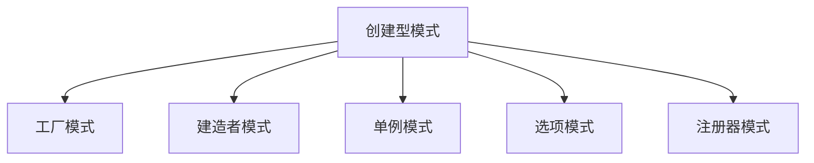

---

title: 创建型模式（Creational Patterns）
outline: deep
-------------

# 创建型模式

::: tip
**创建型模式**专注于“对象的创建机制” —— 在 Go 中，我们用简洁的方式实现复杂的对象初始化流程。
:::

## 为什么我们需要创建型模式？

想象你需要初始化一个数据库连接，代码可能如下：

```go
// ❌ 反例：直接硬编码创建对象
func main() {
    db := &sql.DB{
        driver:   "postgres",
        host:     "localhost",
        port:     5432,
        username: "admin",
        password: "secret",
        // ... 省略其它配置
    }
}
```

这样的写法存在多个问题：

* **配置耦合**：参数写死，难以复用或变更
* **不易测试**：没有注入机制，难替换为 mock
* **缺乏扩展性**：无法适应多种数据库类型
* **易出错**：参数多、顺序固定

🎯 创建型模式正是为了解决这些问题而存在。

---

## 创建型模式一览



每种模式都代表了一种解决“创建复杂对象”的不同方法。接下来我们一一拆解。

---

## 🏭 工厂模式（Factory Pattern）

### 场景适用

当你希望“根据条件”创建不同类型的对象，且不希望暴露具体实现时，工厂模式是首选。

### 常见变体

* 简单工厂（Simple Factory）
* 工厂方法（Factory Method）
* 抽象工厂（Abstract Factory）
* 函数式工厂（Functional Factory）

::: code-group

```go [Simple Factory]
func NewDatabase(config Config) (*sql.DB, error) {
    switch config.Type {
    case PostgreSQL:
        return sql.Open("postgres", dsn)
    case MySQL:
        return sql.Open("mysql", dsn)
    default:
        return nil, errors.New("unsupported type")
    }
}
```

```go [Factory Method]
type LoggerFactory interface {
    CreateLogger() Logger
}
```

```go [Functional Factory]
func NewHTTPClient(options ...ClientOption) *http.Client {
    client := &http.Client{}
    for _, opt := range options {
        opt(client)
    }
    return client
}
```

:::

更多示例见：[工厂模式实现](/practice/patterns/factory)

---

## 🔨 建造者模式（Builder Pattern）

### 场景适用

构建过程复杂、参数组合多变的场景（如 HTTP 服务器、配置对象）。

### 特点

* 方法链（Fluent API）
* 强类型参数设置
* 可扩展性好

::: details 示例：构建 HTTP Server

```go
server := NewServerBuilder().
    Host("0.0.0.0").
    Port(8080).
    AddMiddleware(LogMiddleware).
    AddRoute("/", handler).
    Build()
```

:::

---

## 🎯 选项模式（Option Pattern）

### 场景适用

当构造函数参数太多或变化频繁时，用选项模式是 Go 的惯用手法。

```go
cache := NewCache(
    WithMaxSize(100),
    WithTTL(5 * time.Minute),
    WithEvictionCallback(func(key string, val any) { ... }),
)
```

优点：

* 调用更灵活
* 支持默认值
* 可组合

---

## 🔒 单例模式（Singleton Pattern）

### 场景适用

某个对象全局唯一，且生命周期和程序一致（如配置对象、连接池）。

```go
var once sync.Once
var instance *Config

func GetConfig() *Config {
    once.Do(func() {
        instance = loadConfigFromFile()
    })
    return instance
}
```

📌 推荐用 `sync.Once` 来保证线程安全与懒加载。

---

## 📦 注册器模式（Registry Pattern）

### 场景适用

适合插件系统、驱动管理、动态扩展等需求。

```go
type Registry struct {
    drivers map[string]Driver
}

func (r *Registry) Register(name string, d Driver) {
    r.drivers[name] = d
}

func (r *Registry) Get(name string) Driver {
    return r.drivers[name]
}
```

常见应用：数据库驱动、图像解码器、协议适配器等。

---

## ✅ 模式选择建议

| 目标     | 推荐模式     |
| ------ | -------- |
| 参数组合复杂 | 建造者、选项模式 |
| 多实现切换  | 工厂模式     |
| 只需一个实例 | 单例模式     |
| 支持插件   | 注册器模式    |

---

## 💡 小结

创建型模式是架构设计中“最先落地”的部分。掌握好它们可以让你的 Go 项目初始化流程更清晰、可维护。

🔁 接下来建议继续阅读：[结构型模式](/practice/patterns/structural)，理解如何优雅组合对象。
