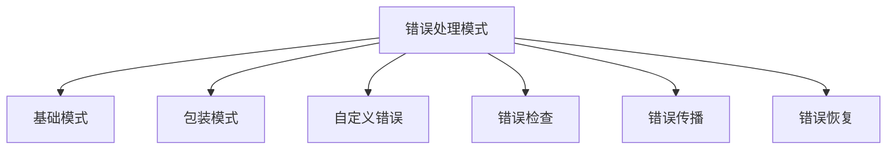

---

title: 错误处理模式（Error Handling Patterns）
outline: deep
-------------

# 错误处理模式

::: tip
**在 Go 中，错误不是异常，而是值。** 这种设计让错误处理更显式、更灵活，并催生出一整套强大的错误处理模式。
:::

## 为什么 Go 的错误处理如此特别？

Go 拒绝传统的 try-catch 异常模型，转而采用 `error` 作为普通返回值，推动显式控制流。

::: details 示例：错误处理模式
```go
result, err := riskyOperation()
if err != nil {
    return fmt.Errorf("operation failed: %w", err)
}
```
:::
💡 核心优势：

* 错误即值，可组合、传递、检查、包装
* 没有隐藏的控制流，逻辑更清晰
* 错误处理变成编码的一部分，难以忽略

---

## 模式全景图



---

## 🧱 基础错误模式

### 简单错误返回

::: details 示例：简单错误返回
```go
func divide(a, b float64) (float64, error) {
    if b == 0 {
        return 0, errors.New("division by zero")
    }
    return a / b, nil
}
```
:::
### 哨兵错误（Sentinel Error）

::: details 示例：哨兵错误
```go
var ErrUserNotFound = errors.New("user not found")

func GetUser(id int) (*User, error) {
    if !exists(id) {
        return nil, ErrUserNotFound
    }
    return &User{}, nil
}
```
:::
### 自定义错误类型

::: details 示例：自定义错误类型
```go
type ValidationError struct {
    Field string
    Msg   string
}

func (e *ValidationError) Error() string {
    return fmt.Sprintf("invalid %s: %s", e.Field, e.Msg)
}
```
:::
---

## 🎁 错误包装模式

### fmt.Errorf + %w

::: details 示例：fmt.Errorf + %w
```go
return fmt.Errorf("create user failed: %w", err)
```
:::
### 自定义包装器

::: details 示例：自定义包装器
```go
return &ContextError{
    Op: "saveUser",
    File: "service.go",
    Err: err,
}
```
:::
使用 `errors.Unwrap()` 和 `errors.As()` 解链。

---

## 🔍 错误检查模式

### errors.Is

::: details 示例：errors.Is
```go
if errors.Is(err, ErrUserNotFound) {
    // 处理用户不存在
}
```
:::     
### errors.As

::: details 示例：errors.As
```go
var ve *ValidationError
if errors.As(err, &ve) {
    fmt.Println("字段错误：", ve.Field)
}
```
:::
---

## 📡 错误传播与聚合

### 错误链

::: details 示例：错误链
```go
return fmt.Errorf("fetch order: %w", dbErr)
```
:::
### 聚合多个错误

::: details 示例：聚合多个错误
```go
errs := []error{err1, err2}
return errors.Join(errs...)
```
:::
---

## 🔄 错误恢复与降级

### panic / recover

::: details 示例：panic / recover
```go
defer func() {
    if r := recover(); r != nil {
        log.Printf("panic: %v", r)
    }
}()
```
:::
### Fallback 模式

::: details 示例：Fallback 模式
```go
if err := primary.Do(); err != nil {
    log.Println("主服务失败，尝试降级")
    return fallback.Do()
}
```
:::
### 重试机制

::: details 示例：重试机制
```go
for i := 0; i < 3; i++ {
    if err := op(); err == nil {
        break
    }
    time.Sleep(time.Second)
}
```
:::
---

## ✅ 模式选型建议

| 目标     | 推荐模式             |
| ------ | ---------------- |
| 显式错误返回 | 简单返回 / 哨兵错误      |
| 错误信息丰富 | 包装 / 自定义错误       |
| 多层追踪错误 | 错误链 / %w 包装      |
| 类型分支处理 | errors.As        |
| 统一恢复入口 | panic + recover  |
| 尝试多方案  | fallback / retry |

---

## 💡 错误处理心法

1. **错误是值**：可比较、可传递、可装饰
2. **显式为王**：拒绝 try-catch 黑魔法
3. **添加上下文**：定位与调试更轻松
4. **尽早失败**：Fail fast, return early
5. **用户友好**：技术错误应转译为友好的消息

---

📘 推荐继续阅读：[并发模式](/practice/patterns/concurrency)，提升系统的健壮性与可恢复性。
