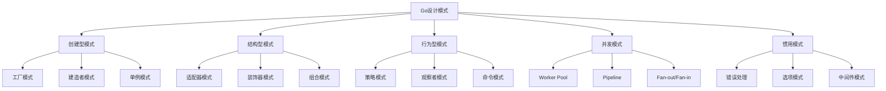

# 设计模式 Patterns

> 设计模式不是教条，而是解决问题的经验总结——在Go的世界里，简单往往胜过复杂

## 🤔 Go语言中的设计模式有何不同？

传统的设计模式书籍往往基于面向对象语言编写，但Go不是传统的面向对象语言。这是否意味着设计模式在Go中不适用？恰恰相反——**Go用更简单的方式实现了设计模式的核心思想**。

### Go设计模式的独特性

#### 🔍 组合优于继承
```go
// 传统OOP中可能使用继承
// class Dog extends Animal { }

// Go中使用组合
type Animal struct {
    Name string
    Age  int
}

type Dog struct {
    Animal  // 嵌入结构体，实现组合
    Breed   string
}

// 自然的"继承"行为
func (a Animal) Sleep() {
    fmt.Printf("%s is sleeping\n", a.Name)
}

func main() {
    dog := Dog{
        Animal: Animal{Name: "Buddy", Age: 3},
        Breed:  "Golden Retriever",
    }
    
    dog.Sleep() // 可以调用"父类"方法
}
```

#### 🎯 接口的鸭子类型
```go
// Go的接口是隐式实现的
type Writer interface {
    Write([]byte) (int, error)
}

// 任何实现了Write方法的类型都自动满足Writer接口
type FileWriter struct{ /* ... */ }
func (f FileWriter) Write(data []byte) (int, error) { /* ... */ }

type NetworkWriter struct{ /* ... */ }  
func (n NetworkWriter) Write(data []byte) (int, error) { /* ... */ }

// 不需要显式声明"implements Writer"
```

#### ⚡ 并发原语内建
```go
// Go的goroutine和channel让并发模式变得自然
func producer(ch chan<- int) {
    for i := 0; i < 10; i++ {
        ch <- i
    }
    close(ch)
}

func consumer(ch <-chan int) {
    for value := range ch {
        fmt.Println("Received:", value)
    }
}

func main() {
    ch := make(chan int)
    go producer(ch)
    consumer(ch)
}
```

## 📊 Go设计模式全景

### 模式分类重新思考



Go特有的模式分类：
- **传统模式**：经典设计模式的Go实现
- **并发模式**：利用goroutine和channel的模式
- **惯用模式**：Go社区特有的最佳实践

## 🏗️ 创建型模式

### [创建型模式详解](/practice/patterns/creational)

**核心思想**：将对象创建的复杂性封装起来，提供灵活的对象创建机制。

#### 为什么需要创建型模式？

```go
// ❌ 直接创建对象的问题
func main() {
    // 硬编码依赖，难以测试和扩展
    db := &PostgreSQLDB{
        host:     "localhost",
        port:     5432,
        database: "myapp",
        username: "user",
        password: "password",
    }
    
    service := &UserService{db: db}
    // ...
}

// ✅ 使用工厂模式
func NewUserService(config DBConfig) *UserService {
    var db Database
    
    switch config.Type {
    case "postgres":
        db = NewPostgreSQLDB(config)
    case "mysql":
        db = NewMySQLDB(config)
    default:
        db = NewInMemoryDB()
    }
    
    return &UserService{db: db}
}
```

#### Go中的创建型模式特色

- **函数式工厂**：利用Go的函数作为一等公民
- **选项模式**：优雅地处理多参数构造
- **构建者链式调用**：流畅的API设计

## 🔧 结构型模式

### [结构型模式详解](/practice/patterns/structural)

**核心思想**：如何组合对象和类，形成更大的结构，同时保持系统的灵活性。

#### Go中的组合之美

```go
// 适配器模式的Go实现
type LegacyPrinter struct{}
func (p LegacyPrinter) OldPrint(text string) {
    fmt.Println("Legacy:", text)
}

type ModernPrinter interface {
    Print(text string)
}

// 适配器：让旧接口适应新接口
type PrinterAdapter struct {
    legacy LegacyPrinter
}

func (a PrinterAdapter) Print(text string) {
    a.legacy.OldPrint(text) // 适配调用
}

// 装饰器模式：为对象添加新功能
type LoggingPrinter struct {
    printer ModernPrinter
}

func (l LoggingPrinter) Print(text string) {
    fmt.Println("Logging: about to print")
    l.printer.Print(text)
    fmt.Println("Logging: print completed")
}
```

#### 结构型模式的Go特色

- **接口组合**：小接口组合成大功能
- **嵌入结构体**：自然的组合模式实现
- **装饰器链**：中间件模式的基础

## 🎯 行为型模式

### [行为型模式详解](/practice/patterns/behavioral)

**核心思想**：关注对象之间的通信和责任分配，让系统行为更加灵活。

#### 策略模式的Go实现

```go
// 策略接口
type PaymentStrategy interface {
    Pay(amount float64) error
}

// 具体策略
type CreditCardPayment struct {
    cardNumber string
}

func (c CreditCardPayment) Pay(amount float64) error {
    fmt.Printf("Paid %.2f using credit card %s\n", amount, c.cardNumber)
    return nil
}

type PayPalPayment struct {
    email string
}

func (p PayPalPayment) Pay(amount float64) error {
    fmt.Printf("Paid %.2f using PayPal %s\n", amount, p.email)
    return nil
}

// 上下文
type PaymentProcessor struct {
    strategy PaymentStrategy
}

func (p *PaymentProcessor) SetStrategy(strategy PaymentStrategy) {
    p.strategy = strategy
}

func (p *PaymentProcessor) ProcessPayment(amount float64) error {
    return p.strategy.Pay(amount)
}
```

#### 行为型模式的Go优势

- **接口的隐式实现**：无需继承层次
- **函数作为策略**：更轻量的策略模式
- **channel通信**：观察者模式的自然实现

## ⚡ 并发模式

### [并发模式详解](/practice/patterns/concurrency)

**Go的独门秘籍**：这是Go语言最独特的部分，其他语言很难如此优雅地实现。

#### Worker Pool模式

```go
// 工作任务
type Job struct {
    ID   int
    Data string
}

type Result struct {
    JobID int
    Value string
    Error error
}

// Worker Pool实现
func WorkerPool(jobs <-chan Job, results chan<- Result, numWorkers int) {
    var wg sync.WaitGroup
    
    // 启动多个worker
    for i := 0; i < numWorkers; i++ {
        wg.Add(1)
        go func(workerID int) {
            defer wg.Done()
            for job := range jobs {
                // 处理任务
                result := processJob(job)
                results <- result
            }
        }(i)
    }
    
    // 等待所有worker完成
    go func() {
        wg.Wait()
        close(results)
    }()
}

func processJob(job Job) Result {
    // 模拟耗时操作
    time.Sleep(time.Millisecond * 100)
    return Result{
        JobID: job.ID,
        Value: "processed: " + job.Data,
    }
}
```

#### Pipeline模式

```go
// 数据处理管道
func Pipeline(input <-chan int) <-chan string {
    // 阶段1：数字处理
    stage1 := make(chan int)
    go func() {
        defer close(stage1)
        for num := range input {
            stage1 <- num * 2 // 乘以2
        }
    }()
    
    // 阶段2：转换为字符串
    stage2 := make(chan string)
    go func() {
        defer close(stage2)
        for num := range stage1 {
            stage2 <- fmt.Sprintf("result: %d", num)
        }
    }()
    
    return stage2
}
```

## 🛠️ Go惯用模式

### [错误处理模式](/practice/patterns/error-handling)

**Go的招牌特色**：显式错误处理的各种模式。

#### 错误包装模式

```go
import (
    "fmt"
    "errors"
)

// 自定义错误类型
type ValidationError struct {
    Field   string
    Message string
}

func (e ValidationError) Error() string {
    return fmt.Sprintf("validation failed for %s: %s", e.Field, e.Message)
}

// 错误包装
func ValidateUser(user User) error {
    if user.Email == "" {
        return &ValidationError{
            Field:   "email",
            Message: "email is required",
        }
    }
    
    if !isValidEmail(user.Email) {
        return fmt.Errorf("invalid email format: %w", 
            &ValidationError{Field: "email", Message: "invalid format"})
    }
    
    return nil
}

// 错误处理链
func CreateUser(user User) error {
    if err := ValidateUser(user); err != nil {
        return fmt.Errorf("user creation failed: %w", err)
    }
    
    if err := saveUserToDB(user); err != nil {
        return fmt.Errorf("failed to save user: %w", err)
    }
    
    return nil
}
```

#### 选项模式

```go
// 配置选项
type ServerOption func(*Server)

type Server struct {
    host    string
    port    int
    timeout time.Duration
    logger  Logger
}

// 选项函数
func WithHost(host string) ServerOption {
    return func(s *Server) {
        s.host = host
    }
}

func WithPort(port int) ServerOption {
    return func(s *Server) {
        s.port = port
    }
}

func WithTimeout(timeout time.Duration) ServerOption {
    return func(s *Server) {
        s.timeout = timeout
    }
}

// 构造函数
func NewServer(options ...ServerOption) *Server {
    server := &Server{
        host:    "localhost", // 默认值
        port:    8080,        // 默认值
        timeout: 30 * time.Second,
    }
    
    // 应用选项
    for _, option := range options {
        option(server)
    }
    
    return server
}

// 优雅的使用方式
func main() {
    server := NewServer(
        WithHost("0.0.0.0"),
        WithPort(9090),
        WithTimeout(60*time.Second),
    )
    
    server.Start()
}
```

## 🎯 模式选择指南

### 何时使用哪种模式？

| 场景 | 推荐模式 | 原因 |
|------|---------|------|
| 对象创建复杂 | 工厂模式 | 封装创建逻辑 |
| 需要多种配置 | 选项模式 | 灵活的参数传递 |
| 功能扩展 | 装饰器模式 | 动态添加功能 |
| 算法切换 | 策略模式 | 运行时选择算法 |
| 并发处理 | Worker Pool | 控制并发数量 |
| 数据流处理 | Pipeline | 阶段式处理 |
| 错误传播 | 错误包装 | 保留错误上下文 |

### 反模式警告

#### ❌ 过度设计
```go
// 不需要为简单功能创建复杂的模式
type SimpleCalculator interface {
    Add(a, b int) int
}

type CalculatorFactory interface {
    CreateCalculator() SimpleCalculator
}

// 这对于简单的加法运算来说过于复杂
```

#### ✅ 适度设计
```go
// 简单问题用简单方案
func Add(a, b int) int {
    return a + b
}

// 只有在真正需要时才引入模式
```

## 🚀 实践建议

### 1. 渐进式应用

**第一阶段**：掌握基础模式
- 错误处理模式
- 选项模式  
- 简单工厂模式

**第二阶段**：学习结构型模式
- 适配器模式
- 装饰器模式
- 组合模式

**第三阶段**：精通并发模式
- Worker Pool
- Pipeline
- Fan-out/Fan-in

### 2. Go特色优先

- **优先使用接口**：而不是继承
- **优先使用组合**：而不是复杂的类层次
- **优先使用channel**：而不是锁
- **优先使用简单**：而不是复杂的设计

### 3. 模式vs简单性

在Go中，**简单性始终是第一原则**。如果一个设计模式让代码变得复杂难懂，那么可能不适合用Go来实现，或者根本不需要这个模式。

---

💡 **设计模式心法**：模式是手段，不是目的。在Go的世界里，最好的模式往往是最简单的那个。不要为了使用模式而使用模式，而要为了解决实际问题而使用模式。

**开始学习**：建议从[错误处理模式](/practice/patterns/error-handling)开始，这是Go开发中最常用也最重要的模式。 