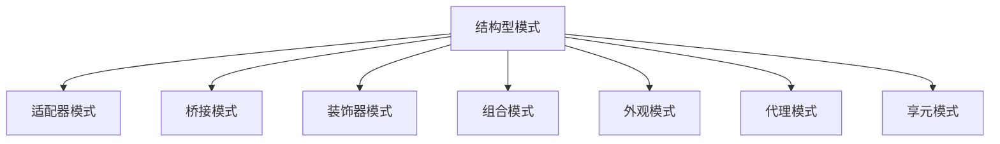

---

title: 结构型模式（Structural Patterns）
outline: deep
-------------

# 结构型模式

::: tip
**结构型模式**关注如何组织多个对象，以构建更大、更灵活的系统结构。在 Go 中，组合优于继承的设计哲学让结构型模式更自然、轻量。 
:::

## 为什么 Go 的结构型模式更优雅？

与传统 OOP 中的“继承树”不同，Go 倾向于使用接口 + 嵌入组合对象行为：

```go
// Go 的组合方式

type Shape interface {
    Area() float64
}

type Rectangle struct {
    Width, Height float64
}

func (r Rectangle) Area() float64 {
    return r.Width * r.Height
}

type ColoredShape struct {
    Shape         // 接口嵌入
    Color string  // 扩展属性
}
```

✅ Go 的组合设计带来了：

* **更灵活的结构组织**
* **不引入额外继承层次**
* **便于解耦与测试**

---

## 结构型模式一览



---

## 🔌 适配器模式（Adapter）

将一个接口转换为另一个接口，典型用于对接遗留代码。

### 示例：将旧系统支付接口适配为现代接口

```go
// 目标接口
interface PaymentProcessor {
    ProcessPayment(amount float64, currency string) Result
}

// 遗留系统接口
LegacyPaymentSystem.MakePayment(sum float64, curr string) bool

// 适配器实现
func (l *LegacyAdapter) ProcessPayment(a float64, c string) Result {
    ok := l.Legacy.MakePayment(a, c)
    return wrap(ok)
}
```

更多见：[适配器完整示例](/practice/patterns/structural#适配器模式)

---

## 🎨 装饰器模式（Decorator）

动态为对象添加功能，而不修改其结构。在 Go 中大量用于 HTTP 中间件链：

```go
func Logging(next http.HandlerFunc) http.HandlerFunc {
    return func(w http.ResponseWriter, r *http.Request) {
        log.Println(r.Method, r.URL.Path)
        next(w, r)
    }
}
```

组合中间件：

```go
handler := Auth(CORS(Logging(finalHandler)))
```

---

## 🌳 组合模式（Composite）

用于树形结构（如文件系统、UI 组件树），允许你将对象组合成层次结构，并像处理单个对象一样使用它们。

```go
type Node interface {
    Render() string
}

type Text struct {
    Value string
}
func (t Text) Render() string { return t.Value }

type Container struct {
    Children []Node
}
func (c Container) Render() string {
    var out string
    for _, child := range c.Children {
        out += child.Render()
    }
    return out
}
```

---

## 🔗 桥接模式（Bridge）

将抽象与实现分离，使它们可以独立演化。

```go
// 抽象层
interface Notification {
    Send(title, content string)
}

// 实现层接口
interface Sender {
    SendMessage(msg string)
}

// 桥接
struct EmailNotification {
    Sender Sender
}
```

---

## 🧱 外观模式（Facade）

为复杂子系统提供一个统一入口，简化调用：

```go
// 子系统
AuthService.Login(), OrderService.Create()

// 外观
AppFacade.PlaceOrder(user, product) {
    AuthService.Login(user)
    OrderService.Create(product)
}
```

---

## 🛰️ 代理模式（Proxy）

为某对象提供“访问控制”或“增强行为”的代理对象，常用于缓存、权限控制等：

```go
func (p *CacheProxy) Get(key string) (Value, error) {
    if val := p.Cache.Get(key); val != nil {
        return val, nil
    }
    val := p.Real.Get(key)
    p.Cache.Set(key, val)
    return val, nil
}
```

---

## ♻️ 享元模式（Flyweight）

通过共享对象来减少内存开销，适合大量重复数据的场景。

```go
type GlyphFactory struct {
    glyphs map[string]*Glyph
}

func (f *GlyphFactory) Get(char string) *Glyph {
    if g, ok := f.glyphs[char]; ok {
        return g
    }
    g := &Glyph{char: char}
    f.glyphs[char] = g
    return g
}
```

---

## ✅ 模式选择建议

| 目标        | 推荐模式  |
| --------- | ----- |
| 接口不兼容     | 适配器模式 |
| 树形结构组织    | 组合模式  |
| 动态功能增强    | 装饰器模式 |
| 统一复杂子系统入口 | 外观模式  |
| 控制访问 / 缓存 | 代理模式  |

---

## 💡 小结

结构型模式关注的是\*\*“如何组合对象”\*\*，而不是“对象的行为”本身。它们可以让系统在保持灵活性的同时，具备良好的可维护性。

📦 下一步推荐阅读：[行为型模式](/practice/patterns/behavioral)，理解对象间如何通信协作。
