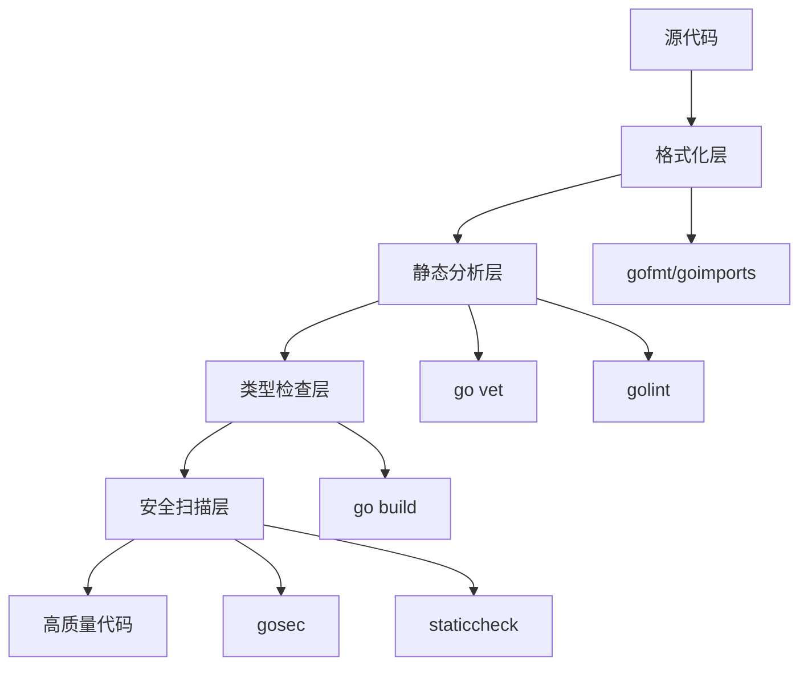

# 代码质量工具 Code Quality

> 代码质量不是主观判断，而是可以客观衡量和持续改进的

## 🎯 什么是高质量的Go代码？

在讨论工具之前，我们需要先理解什么是高质量的Go代码。Go语言有一个独特的优势：**社区对代码质量的标准高度一致**。

### 高质量Go代码的特征

#### 🔍 可读性优先
```go
// ❌ 难以理解的代码
func p(u string) ([]byte, error) {
    r, e := http.Get(u)
    if e != nil { return nil, e }
    defer r.Body.Close()
    return ioutil.ReadAll(r.Body)
}

// ✅ 清晰易懂的代码
func fetchUserProfile(userURL string) ([]byte, error) {
    response, err := http.Get(userURL)
    if err != nil {
        return nil, fmt.Errorf("failed to fetch user profile: %w", err)
    }
    defer response.Body.Close()
    
    profile, err := ioutil.ReadAll(response.Body)
    if err != nil {
        return nil, fmt.Errorf("failed to read response body: %w", err)
    }
    
    return profile, nil
}
```

#### 📏 一致性胜过个性
Go的格式化工具`gofmt`强制统一代码风格，这消除了团队中的"风格之争"，让大家专注于业务逻辑。

#### 🛡️ 安全性内建
Go的工具链在设计时就考虑了安全性，`go vet`可以发现许多潜在的安全问题。

## 🛠️ Go代码质量工具全景

### 工具分层理解



## 📐 格式化工具：代码的"统一标准"

### gofmt：Go的代码格式化标准

`gofmt`不仅仅是一个工具，它代表了Go社区的一个重要理念：**格式化的代码比个性化的代码更有价值**。

#### 基本使用
```bash
# 格式化单个文件
gofmt -w main.go

# 格式化整个目录
gofmt -w .

# 预览更改（不实际修改）
gofmt -d main.go

# 简化代码结构
gofmt -s main.go
```

#### 为什么使用gofmt？

**一致性价值**：
- 所有Go代码看起来都一样
- 代码评审时专注于逻辑而非格式
- 新团队成员快速适应

**自动化优势**：
- 编辑器集成，保存时自动格式化
- CI/CD中强制检查格式一致性

### goimports：智能导入管理

`goimports`是`gofmt`的增强版本，不仅格式化代码，还自动管理import语句。

#### 核心功能
```go
// 之前：手动管理导入
package main

import (
    "fmt"
    "net/http"
    // 忘记导入strings包
)

func main() {
    // 使用了strings包但忘记导入
    result := strings.TrimSpace("  hello  ")
    fmt.Println(result)
}
```

```bash
# 运行goimports后
goimports -w main.go
```

```go
// 之后：自动添加缺失的导入
package main

import (
    "fmt"
    "strings"  // 自动添加
)

func main() {
    result := strings.TrimSpace("  hello  ")
    fmt.Println(result)
}
```

#### 高级配置

```bash
# 本地导入优先（将项目内部包分组）
goimports -local "github.com/yourorg/yourproject" -w .
```

## 🔍 静态分析：发现潜在问题

### go vet：Go内置的代码审查员

`go vet`是Go工具链的重要组成部分，它能发现编译器无法检测到的错误。

#### 常见检查项目

```go
// 1. Printf格式字符串错误
func badPrintf() {
    name := "Alice"
    age := 30
    // ❌ 格式字符串与参数不匹配
    fmt.Printf("Name: %s, Age: %d\n", age, name)
    
    // ✅ 正确的格式
    fmt.Printf("Name: %s, Age: %d\n", name, age)
}

// 2. 未使用的变量
func unusedVariable() {
    x := 42  // ❌ x被声明但未使用
    fmt.Println("Hello")
}

// 3. 无效的构建约束
// +build ignore
// ❌ 构建标签格式错误

// 4. 原子操作错误
func atomicError() {
    var counter int64
    // ❌ 原子操作的值没有被使用
    atomic.AddInt64(&counter, 1)
    
    // ✅ 正确使用原子操作
    newValue := atomic.AddInt64(&counter, 1)
    fmt.Println(newValue)
}
```

#### 使用技巧

```bash
# 检查当前包
go vet

# 检查所有子包
go vet ./...

# 检查特定问题
go vet -printf ./...

# 在构建时自动运行
go build -vet ./...
```

### golint：代码风格检查

虽然`golint`已经不再维护，但理解它的检查规则对写出地道的Go代码很重要。

#### 核心检查规则

```go
// 1. 导出函数需要注释
// ❌ 缺少注释
func CalculateSum(a, b int) int {
    return a + b
}

// ✅ 有适当注释
// CalculateSum returns the sum of two integers.
func CalculateSum(a, b int) int {
    return a + b
}

// 2. 变量命名规范
// ❌ 不符合Go命名约定
func processHTTPRequest() {
    userID := getUserId()  // 应该是getUserID
    xmlData := parseXML()  // 应该是parseXML
}

// ✅ 符合Go命名约定
func processHTTPRequest() {
    userID := getUserID()
    xmlData := parseXML()
}

// 3. 错误字符串格式
// ❌ 错误信息首字母大写或以标点结尾
func validateInput(input string) error {
    if input == "" {
        return errors.New("Input cannot be empty.")
    }
    return nil
}

// ✅ 正确的错误信息格式
func validateInput(input string) error {
    if input == "" {
        return errors.New("input cannot be empty")
    }
    return nil
}
```

### staticcheck：现代静态分析工具

`staticcheck`是`golint`的现代替代品，提供更全面的代码检查。

#### 安装和使用

```bash
# 安装
go install honnef.co/go/tools/cmd/staticcheck@latest

# 基本使用
staticcheck ./...

# 检查特定规则
staticcheck -checks=SA1* ./...

# 输出JSON格式（适合CI集成）
staticcheck -f json ./...
```

#### 高级检查示例

```go
// 1. 检测无效的字符串比较
func stringComparison() {
    s := "hello"
    // ❌ staticcheck会检测到这个问题
    if len(s) == 0 {
        // 应该使用 s == ""
    }
    
    // ✅ 更高效的写法
    if s == "" {
        // 处理空字符串
    }
}

// 2. 检测无用的type assertion
func typeAssertion() {
    var x interface{} = "hello"
    // ❌ 无用的类型断言
    s := x.(string)
    _ = s
    
    // ✅ 如果确定类型，直接使用
    s := "hello"
    _ = s
}

// 3. 检测潜在的nil指针访问
func nilPointer() {
    var m map[string]int
    // ❌ 可能导致panic
    m["key"] = 1
    
    // ✅ 安全的写法
    if m == nil {
        m = make(map[string]int)
    }
    m["key"] = 1
}
```

## 🔒 安全扫描工具

### gosec：Go安全分析器

`gosec`专门用于检测Go代码中的安全问题。

#### 安装和基本使用

```bash
# 安装
go install github.com/securecodewarrior/gosec/v2/cmd/gosec@latest

# 扫描当前项目
gosec ./...

# 生成详细报告
gosec -fmt=json -out=results.json ./...
```

#### 常见安全问题检测

```go
// 1. SQL注入风险
func badSQLQuery(db *sql.DB, userInput string) error {
    // ❌ 潜在的SQL注入
    query := "SELECT * FROM users WHERE name = '" + userInput + "'"
    _, err := db.Exec(query)
    return err
}

func safeSQLQuery(db *sql.DB, userInput string) error {
    // ✅ 使用参数化查询
    query := "SELECT * FROM users WHERE name = ?"
    _, err := db.Exec(query, userInput)
    return err
}

// 2. 硬编码密码
func badPasswordHandling() {
    // ❌ 硬编码敏感信息
    password := "super-secret-password"
    connectToDatabase(password)
}

func goodPasswordHandling() {
    // ✅ 从环境变量读取
    password := os.Getenv("DB_PASSWORD")
    if password == "" {
        log.Fatal("DB_PASSWORD environment variable not set")
    }
    connectToDatabase(password)
}

// 3. 不安全的随机数生成
func badRandomGeneration() {
    // ❌ 使用可预测的随机数生成器
    rand.Seed(time.Now().UnixNano())
    token := rand.Intn(1000000)
    fmt.Printf("Token: %d\n", token)
}

func goodRandomGeneration() {
    // ✅ 使用密码学安全的随机数
    token := make([]byte, 32)
    _, err := crypto_rand.Read(token)
    if err != nil {
        log.Fatal("Failed to generate random token")
    }
    fmt.Printf("Token: %x\n", token)
}
```

## 🔧 工具集成和自动化

### 编辑器集成

#### VS Code配置
```json
{
    "go.lintTool": "staticcheck",
    "go.lintFlags": ["-checks=all"],
    "go.vetFlags": ["-all"],
    "go.formatTool": "goimports",
    "editor.formatOnSave": true,
    "editor.codeActionsOnSave": {
        "source.organizeImports": true
    }
}
```

### Makefile自动化

```makefile
# Makefile
.PHONY: lint vet fmt check-fmt security

# 格式化代码
fmt:
	goimports -w .

# 检查格式
check-fmt:
	@if [ -n "$$(goimports -l .)" ]; then \
		echo "Code is not formatted. Run 'make fmt'"; \
		exit 1; \
	fi

# 运行vet检查
vet:
	go vet ./...

# 运行lint检查
lint:
	staticcheck ./...

# 安全扫描
security:
	gosec ./...

# 完整的代码质量检查
quality: check-fmt vet lint security
	@echo "All quality checks passed!"
```

### CI/CD集成

#### GitHub Actions配置

```yaml
# .github/workflows/quality.yml
name: Code Quality

on: [push, pull_request]

jobs:
  quality:
    runs-on: ubuntu-latest
    steps:
    - uses: actions/checkout@v3
    
    - name: Set up Go
      uses: actions/setup-go@v3
      with:
        go-version: 1.21
        
    - name: Install tools
      run: |
        go install honnef.co/go/tools/cmd/staticcheck@latest
        go install github.com/securecodewarrior/gosec/v2/cmd/gosec@latest
        
    - name: Check formatting
      run: |
        if [ -n "$(gofmt -l .)" ]; then
          echo "Code is not formatted:"
          gofmt -l .
          exit 1
        fi
        
    - name: Run vet
      run: go vet ./...
      
    - name: Run staticcheck
      run: staticcheck ./...
      
    - name: Run security scan
      run: gosec ./...
```

## 📊 质量度量和监控

### 代码质量指标

#### 1. 圈复杂度监控
```bash
# 使用gocyclo检查复杂度
go install github.com/fzipp/gocyclo/cmd/gocyclo@latest
gocyclo -top 10 .
```

#### 2. 代码重复检测
```bash
# 使用dupl检测重复代码
go install github.com/mibk/dupl@latest
dupl -threshold 50 .
```

#### 3. 代码覆盖率
```bash
# 生成覆盖率报告
go test -coverprofile=coverage.out ./...
go tool cover -html=coverage.out -o coverage.html
```

### 质量门禁设置

```bash
# quality-gate.sh
#!/bin/bash

set -e

echo "🔍 Running code quality checks..."

# 格式检查
echo "Checking code formatting..."
if [ -n "$(gofmt -l .)" ]; then
    echo "❌ Code formatting issues found"
    gofmt -l .
    exit 1
fi

# 静态分析
echo "Running static analysis..."
go vet ./...
staticcheck ./...

# 安全扫描
echo "Running security scan..."
gosec -quiet ./...

# 测试覆盖率检查
echo "Checking test coverage..."
COVERAGE=$(go test -coverprofile=coverage.out ./... | grep "coverage:" | awk '{print $3}' | sed 's/%//')
if (( $(echo "$COVERAGE < 80" | bc -l) )); then
    echo "❌ Test coverage ($COVERAGE%) is below 80%"
    exit 1
fi

echo "✅ All quality checks passed!"
```

## 🚀 最佳实践总结

### 1. 渐进式采用策略

**第一阶段**：基础工具
- 启用`gofmt`和`goimports`
- 配置编辑器自动格式化
- 在CI中添加格式检查

**第二阶段**：静态分析
- 添加`go vet`检查
- 引入`staticcheck`
- 修复现有问题

**第三阶段**：安全和质量
- 集成`gosec`安全扫描
- 设置代码覆盖率要求
- 建立质量门禁

### 2. 团队协作规范

#### 代码评审清单
- [ ] 代码格式符合`gofmt`标准
- [ ] 通过所有静态分析检查
- [ ] 无安全扫描告警
- [ ] 测试覆盖率符合要求
- [ ] 导出函数有适当注释

#### 工具配置统一
- 使用`.editorconfig`统一编辑器配置
- 共享`golangci-lint`配置文件
- 在`Makefile`中标准化命令

### 3. 持续改进

#### 定期评估
- 每月检查工具更新
- 评估新工具的价值
- 调整质量标准

#### 度量驱动
- 跟踪代码质量指标趋势
- 识别常见问题模式
- 制定针对性改进措施

---

💡 **记住**：工具只是手段，目标是写出高质量的Go代码。不要为了使用工具而使用工具，而要理解每个工具解决的具体问题，然后有针对性地应用它们。

**下一步**：学习[测试和基准测试](/practice/tools/testing)，掌握Go的测试生态系统。
