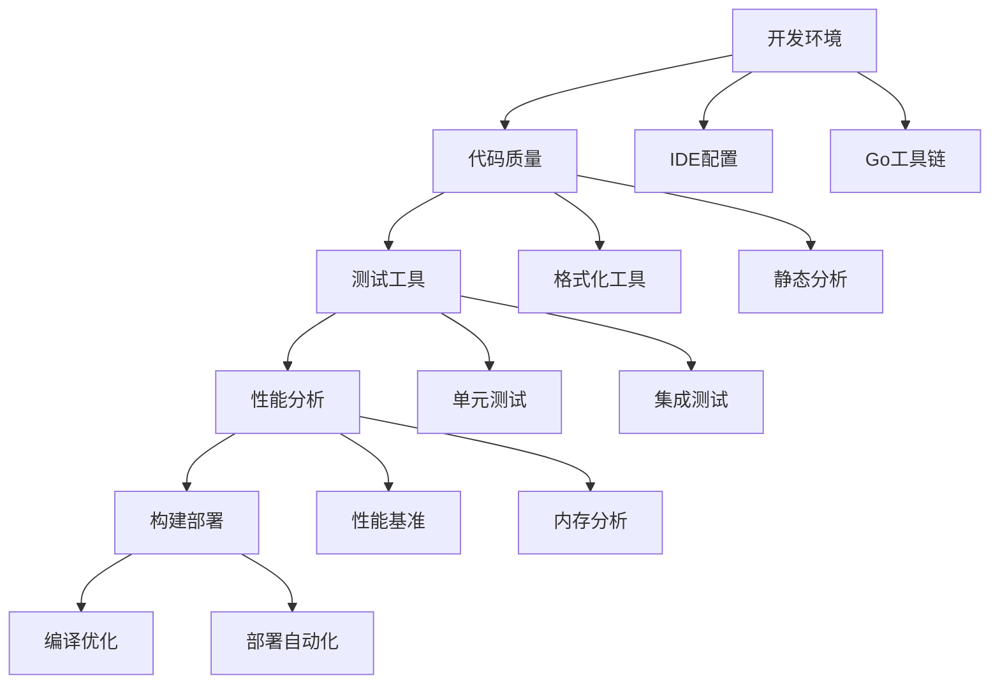

# 工具链 Tools

> 工具链是Go工程师的延伸，掌握它们就是在投资自己的开发效率

## 🤔 为什么工具链如此重要？

在Go的世界里，工具不仅仅是辅助，它们是Go哲学的重要体现。Go语言本身就内置了强大的工具链，这不是偶然的——它反映了Go团队对开发者体验的深度思考。

想象一下这样的场景：你写了一段代码，`gofmt` 自动格式化让团队代码风格保持一致；`go vet` 在编译前就发现潜在问题；`go test` 让测试变得自然而简单。这不是在增加复杂性，而是在**简化复杂性**。

### 🎯 工具链的核心价值

**一致性** → 团队协作的基础  
**自动化** → 减少人为错误  
**反馈循环** → 更快发现和修复问题  
**质量保障** → 代码质量的客观标准  

## 📊 工具链学习路径

## 🛠️ 核心工具模块

### [开发环境配置](/practice/tools/development-setup)
**第一步，也是最重要的一步**

搭建一个高效的开发环境就像为工匠准备趁手的工具。我们会从零开始，配置一个让你爱上Go开发的环境：

- **IDE选择与配置**：VS Code、GoLand、Vim的深度配置
- **Go工具链安装**：从go安装到GOPATH/GOMODULE的最佳实践
- **调试环境**：delve调试器的使用技巧
- **插件生态**：提升效率的必备插件

### [代码质量工具](/practice/tools/code-quality)
**让代码说话，而不是争论**

代码质量不是主观判断，而是可以客观衡量的。Go提供了一套完整的代码质量工具，让我们学会如何使用它们：

- **格式化工具**：gofmt、goimports的使用和配置
- **静态分析**：go vet、golint、staticcheck的深入使用
- **代码规范**：Go Code Review Comments的实践应用
- **自动化集成**：在编辑器和CI中集成质量检查

### [测试和基准测试](/practice/tools/testing)
**测试不是负担，而是信心的来源**

测试是Go语言的一等公民，内置的测试框架简单而强大。我们会学习如何写出有价值的测试：

- **测试基础**：从简单的单元测试到复杂的集成测试
- **测试框架**：testify、GoMock、httptest的实战应用
- **基准测试**：性能测试和性能回归检测
- **测试策略**：测试金字塔在Go项目中的应用

### [性能分析工具](/practice/tools/profiling)
**性能优化的科学方法**

过早的优化是万恶之源，但恰当的性能分析是必需的。Go提供了世界级的性能分析工具：

- **pprof深入**：CPU、内存、goroutine分析的实战技巧
- **trace工具**：理解Go程序的执行轨迹
- **基准对比**：benchstat工具的使用和性能回归检测
- **生产环境监控**：如何在不影响性能的情况下进行性能监控

### [构建和部署工具](/practice/tools/build-deploy)
**从代码到产品的最后一公里**

构建和部署是开发流程的重要环节，我们会学习现代Go项目的构建部署最佳实践：

- **构建优化**：go build的高级参数和编译优化
- **Makefile实践**：复杂Go项目的构建脚本管理
- **容器化**：Docker多阶段构建的Go应用实践
- **CI/CD集成**：GitHub Actions、GitLab CI的Go项目配置

## 🚀 实践理念

### 渐进式掌握
不要试图一次性学会所有工具。就像学习Go语言一样，从简单开始，逐步深入。

### 理解原理
工具只是表象，理解工具背后的原理才能真正掌握它们。比如理解`gofmt`的AST处理机制，比单纯使用它更有价值。

### 自动化优先
能自动化的就不要手动。好的工具链应该让重复性工作消失，让你专注于真正有价值的创造性工作。

### 团队标准
工具链不仅是个人效率工具，更是团队协作的基础。统一的工具链使用标准是高效团队的特征。

---

💡 **开始掌握**：选择从开发环境配置开始，逐步构建你的Go工程师工具箱！ 