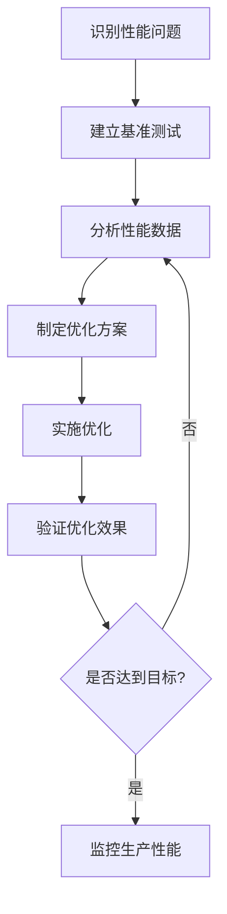

# 性能分析工具 Profiling

> 过早的优化是万恶之源，但恰当的性能分析是必需的——让数据指导你的优化决策

## 🤔 为什么Go的性能分析如此强大？

在许多语言中，性能分析往往需要复杂的第三方工具和繁琐的配置。但Go不同——**性能分析是Go运行时的原生能力**。

这种设计哲学的深层含义：
- **零配置启动**：`go tool pprof`内置在工具链中
- **运行时集成**：无需修改代码即可进行基本分析
- **生产环境友好**：低开销的分析，可以在线上使用
- **可视化优先**：从文本报告到交互式图形界面

Go团队相信：**性能优化应该基于数据，而不是猜测**。

## 🎯 性能分析的科学方法

### 测量优先于优化

```go
// ❌ 基于猜测的优化
func processData(data []string) []string {
    // "字符串操作很慢，我们用strings.Builder优化"
    var builder strings.Builder
    for _, item := range data {
        builder.WriteString(item)
        builder.WriteString(",")
    }
    return strings.Split(builder.String(), ",")
}

// ✅ 先测量，再优化
func processData(data []string) []string {
    // 先写最直观的实现
    result := make([]string, 0, len(data))
    for _, item := range data {
        result = append(result, item)
    }
    return result
}

// 然后用基准测试验证性能问题是否真实存在
func BenchmarkProcessData(b *testing.B) {
    data := generateTestData(1000)
    b.ResetTimer()
    
    for i := 0; i < b.N; i++ {
        processData(data)
    }
}
```

### 优化的三个层次

1. **算法层优化**：O(n²) → O(n log n)
2. **实现层优化**：内存分配、数据结构选择
3. **系统层优化**：并发、I/O、网络

**重要原则**：按顺序进行，每一层的收益远大于下一层。

## 🔧 pprof：Go的性能分析利器

### 基础概念理解

```go
// pprof可以分析以下几种性能数据：
//
// 1. CPU Profile    - CPU使用情况
// 2. Memory Profile - 内存分配情况  
// 3. Block Profile  - 阻塞情况
// 4. Mutex Profile  - 锁竞争情况
// 5. Goroutine Profile - 协程状态

import (
    _ "net/http/pprof" // 启用HTTP性能分析端点
    "net/http"
    "log"
)

func main() {
    // 启动pprof HTTP服务器
    go func() {
        log.Println(http.ListenAndServe("localhost:6060", nil))
    }()
    
    // 你的应用逻辑
    runApplication()
}
```

### CPU性能分析

#### 手动CPU分析

```go
package main

import (
    "os"
    "runtime/pprof"
    "log"
)

func main() {
    // 创建CPU profile文件
    f, err := os.Create("cpu.prof")
    if err != nil {
        log.Fatal(err)
    }
    defer f.Close()
    
    // 开始CPU profiling
    if err := pprof.StartCPUProfile(f); err != nil {
        log.Fatal(err)
    }
    defer pprof.StopCPUProfile()
    
    // 运行需要分析的代码
    performHeavyComputation()
}

func performHeavyComputation() {
    // 模拟CPU密集型任务
    for i := 0; i < 1000000; i++ {
        fibonacci(30)
    }
}

func fibonacci(n int) int {
    if n <= 1 {
        return n
    }
    return fibonacci(n-1) + fibonacci(n-2)
}
```

#### 分析CPU profile

```bash
# 生成profile文件后，使用pprof分析
go tool pprof cpu.prof

# 常用命令：
(pprof) top           # 显示CPU使用最多的函数
(pprof) list main.fibonacci  # 显示函数的详细分析
(pprof) web           # 生成调用图（需要graphviz）
(pprof) flame         # 生成火焰图
(pprof) peek fibonacci # 查看函数调用关系

# 命令行直接分析
go tool pprof -top cpu.prof
go tool pprof -web cpu.prof
```

### 内存分析

#### 内存分析的两个维度

```go
package main

import (
    "runtime"
    "runtime/pprof"
    "os"
    "log"
)

func main() {
    // 运行可能有内存问题的代码
    memoryIntensiveWork()
    
    // 强制垃圾收集，获得更准确的内存分析
    runtime.GC()
    
    // 创建内存profile
    f, err := os.Create("mem.prof")
    if err != nil {
        log.Fatal(err)
    }
    defer f.Close()
    
    if err := pprof.WriteHeapProfile(f); err != nil {
        log.Fatal(err)
    }
}

func memoryIntensiveWork() {
    // 模拟内存分配问题
    data := make([][]byte, 1000)
    
    for i := range data {
        // 每次分配1MB内存
        data[i] = make([]byte, 1024*1024)
        
        // 模拟一些计算工作
        processData(data[i])
    }
    
    // 故意保持引用，观察内存使用
    _ = data
}

func processData(data []byte) {
    // 模拟数据处理
    for i := range data {
        data[i] = byte(i % 256)
    }
}
```

#### 内存分析命令

```bash
# 分析内存使用
go tool pprof mem.prof

# 常用命令：
(pprof) top           # 内存使用最多的函数
(pprof) list memoryIntensiveWork  # 查看函数内存分配
(pprof) web           # 内存分配调用图

# 查看不同类型的内存信息
go tool pprof -alloc_space mem.prof  # 总分配空间
go tool pprof -alloc_objects mem.prof # 总分配对象数
go tool pprof -inuse_space mem.prof   # 当前使用空间
go tool pprof -inuse_objects mem.prof # 当前使用对象数
```

### 实时性能监控

#### HTTP pprof端点

```go
package main

import (
    "net/http"
    _ "net/http/pprof"
    "time"
    "sync"
    "log"
)

func main() {
    // 启动pprof HTTP服务器
    go func() {
        log.Println("pprof server starting on :6060")
        log.Println(http.ListenAndServe("localhost:6060", nil))
    }()
    
    // 模拟应用工作负载
    var wg sync.WaitGroup
    
    // CPU密集型任务
    wg.Add(1)
    go func() {
        defer wg.Done()
        cpuIntensiveTask()
    }()
    
    // 内存密集型任务
    wg.Add(1)
    go func() {
        defer wg.Done()
        memoryIntensiveTask()
    }()
    
    // 阻塞任务
    wg.Add(1)
    go func() {
        defer wg.Done()
        blockingTask()
    }()
    
    wg.Wait()
}

func cpuIntensiveTask() {
    for {
        fibonacci(35)
        time.Sleep(100 * time.Millisecond)
    }
}

func memoryIntensiveTask() {
    data := make([][]byte, 0)
    for {
        // 持续分配内存
        chunk := make([]byte, 1024*1024) // 1MB
        data = append(data, chunk)
        
        // 偶尔清理一些内存
        if len(data) > 100 {
            data = data[50:]
        }
        
        time.Sleep(50 * time.Millisecond)
    }
}

func blockingTask() {
    ch := make(chan struct{})
    
    go func() {
        for {
            time.Sleep(1 * time.Second)
            ch <- struct{}{}
        }
    }()
    
    for {
        <-ch // 阻塞等待
    }
}
```

#### 实时分析命令

```bash
# 连接到运行中的应用进行实时分析

# CPU分析（30秒采样）
go tool pprof http://localhost:6060/debug/pprof/profile?seconds=30

# 当前内存使用
go tool pprof http://localhost:6060/debug/pprof/heap

# 所有内存分配
go tool pprof http://localhost:6060/debug/pprof/allocs

# 阻塞分析
go tool pprof http://localhost:6060/debug/pprof/block

# 互斥锁竞争
go tool pprof http://localhost:6060/debug/pprof/mutex

# Goroutine分析
go tool pprof http://localhost:6060/debug/pprof/goroutine

# 直接在浏览器查看
# http://localhost:6060/debug/pprof/
```

## 🔍 高级分析技术

### 火焰图分析

火焰图是理解程序性能的最直观方式：

```bash
# 生成火焰图
go tool pprof -http=:8080 cpu.prof

# 或者命令行生成SVG
go tool pprof -svg cpu.prof > flame.svg

# 火焰图解读：
# - X轴：样本数量（调用频率）
# - Y轴：调用栈深度
# - 颜色：不同的函数
# - 宽度：函数占用的CPU时间比例
```

### trace工具：理解程序执行轨迹

```go
package main

import (
    "os"
    "runtime/trace"
    "sync"
    "time"
    "log"
)

func main() {
    // 创建trace文件
    f, err := os.Create("trace.out")
    if err != nil {
        log.Fatal(err)
    }
    defer f.Close()
    
    // 开始tracing
    if err := trace.Start(f); err != nil {
        log.Fatal(err)
    }
    defer trace.Stop()
    
    // 运行需要trace的代码
    demonstrateGoroutineInteraction()
}

func demonstrateGoroutineInteraction() {
    var wg sync.WaitGroup
    ch := make(chan int, 10)
    
    // 生产者goroutine
    wg.Add(1)
    go func() {
        defer wg.Done()
        defer close(ch)
        
        for i := 0; i < 100; i++ {
            ch <- i
            time.Sleep(10 * time.Millisecond)
        }
    }()
    
    // 消费者goroutines
    for i := 0; i < 3; i++ {
        wg.Add(1)
        go func(id int) {
            defer wg.Done()
            
            for value := range ch {
                // 模拟处理时间
                time.Sleep(time.Duration(value%10) * time.Millisecond)
                _ = value * value // 简单计算
            }
        }(i)
    }
    
    wg.Wait()
}
```

```bash
# 分析trace文件
go tool trace trace.out

# trace工具会打开web界面，提供以下视图：
# - Timeline view: 时间轴视图，显示goroutine执行情况
# - Goroutine analysis: 分析goroutine的生命周期
# - Network blocking profile: 网络阻塞分析
# - Synchronization blocking profile: 同步阻塞分析
# - Syscall blocking profile: 系统调用阻塞分析
# - Scheduler latency profile: 调度器延迟分析
```

### 内存逃逸分析

```go
package main

import "fmt"

func main() {
    // 分析这些函数的内存逃逸情况
    stackAllocation()
    heapAllocation()
    interfaceEscape()
    sliceEscape()
}

func stackAllocation() {
    // 这个变量会在栈上分配
    x := 42
    fmt.Println(x)
}

func heapAllocation() *int {
    // 这个变量会逃逸到堆上，因为函数返回了它的地址
    x := 42
    return &x
}

func interfaceEscape() {
    // 赋值给interface{}会导致逃逸
    x := 42
    var i interface{} = x
    fmt.Println(i)
}

func sliceEscape() {
    // 大的slice可能会逃逸到堆上
    data := make([]int, 10000)
    processSlice(data)
}

func processSlice(data []int) {
    // 处理slice
    for i := range data {
        data[i] = i
    }
}
```

```bash
# 进行逃逸分析
go build -gcflags="-m" main.go

# 输出示例：
# ./main.go:15:2: moved to heap: x
# ./main.go:20:2: moved to heap: x
# ./main.go:25:12: ... argument does not escape
# ./main.go:25:13: i escapes to heap
# ./main.go:30:11: make([]int, 10000) escapes to heap

# 更详细的分析
go build -gcflags="-m -m" main.go
```

## 📊 性能优化实战案例

### 案例1：字符串拼接优化

```go
package main

import (
    "strings"
    "testing"
)

// 性能问题：频繁的字符串拼接
func slowStringConcat(items []string) string {
    result := ""
    for _, item := range items {
        result += item + ","
    }
    return result
}

// 优化方案1：使用strings.Builder
func fastStringConcat(items []string) string {
    var builder strings.Builder
    
    // 预分配容量（如果知道大概大小）
    builder.Grow(len(items) * 10) // 假设平均每项10字符
    
    for _, item := range items {
        builder.WriteString(item)
        builder.WriteString(",")
    }
    return builder.String()
}

// 优化方案2：使用strings.Join
func fasterStringConcat(items []string) string {
    return strings.Join(items, ",")
}

// 基准测试对比
func BenchmarkSlowStringConcat(b *testing.B) {
    items := make([]string, 1000)
    for i := range items {
        items[i] = "item"
    }
    
    b.ResetTimer()
    for i := 0; i < b.N; i++ {
        slowStringConcat(items)
    }
}

func BenchmarkFastStringConcat(b *testing.B) {
    items := make([]string, 1000)
    for i := range items {
        items[i] = "item"
    }
    
    b.ResetTimer()
    for i := 0; i < b.N; i++ {
        fastStringConcat(items)
    }
}

func BenchmarkFasterStringConcat(b *testing.B) {
    items := make([]string, 1000)
    for i := range items {
        items[i] = "item"
    }
    
    b.ResetTimer()
    for i := 0; i < b.N; i++ {
        fasterStringConcat(items)
    }
}
```

### 案例2：内存池优化

```go
package main

import (
    "sync"
    "testing"
)

// 性能问题：频繁的内存分配和释放
func processDataWithoutPool(data [][]byte) {
    for _, chunk := range data {
        // 处理每个数据块需要临时缓冲区
        buffer := make([]byte, 1024)
        
        // 模拟数据处理
        copy(buffer, chunk)
        processBuffer(buffer)
    }
}

// 优化方案：使用内存池
var bufferPool = sync.Pool{
    New: func() interface{} {
        return make([]byte, 1024)
    },
}

func processDataWithPool(data [][]byte) {
    for _, chunk := range data {
        // 从池中获取缓冲区
        buffer := bufferPool.Get().([]byte)
        
        // 模拟数据处理
        copy(buffer, chunk)
        processBuffer(buffer)
        
        // 归还到池中
        bufferPool.Put(buffer)
    }
}

func processBuffer(buffer []byte) {
    // 模拟处理逻辑
    for i := range buffer {
        buffer[i] = buffer[i] ^ 0xFF
    }
}

// 基准测试对比
func BenchmarkWithoutPool(b *testing.B) {
    data := generateTestData(100)
    
    b.ResetTimer()
    for i := 0; i < b.N; i++ {
        processDataWithoutPool(data)
    }
}

func BenchmarkWithPool(b *testing.B) {
    data := generateTestData(100)
    
    b.ResetTimer()
    for i := 0; i < b.N; i++ {
        processDataWithPool(data)
    }
}

func generateTestData(count int) [][]byte {
    data := make([][]byte, count)
    for i := range data {
        data[i] = make([]byte, 512)
    }
    return data
}
```

### 案例3：并发优化

```go
package main

import (
    "runtime"
    "sync"
    "testing"
)

// 性能问题：串行处理
func processDataSequential(data []int) []int {
    result := make([]int, len(data))
    
    for i, value := range data {
        result[i] = expensiveComputation(value)
    }
    
    return result
}

// 优化方案：并发处理
func processDataConcurrent(data []int) []int {
    result := make([]int, len(data))
    
    // 使用worker pool模式
    numWorkers := runtime.NumCPU()
    jobs := make(chan struct {
        index int
        value int
    }, len(data))
    
    var wg sync.WaitGroup
    
    // 启动workers
    for i := 0; i < numWorkers; i++ {
        wg.Add(1)
        go func() {
            defer wg.Done()
            for job := range jobs {
                result[job.index] = expensiveComputation(job.value)
            }
        }()
    }
    
    // 发送任务
    for i, value := range data {
        jobs <- struct {
            index int
            value int
        }{i, value}
    }
    close(jobs)
    
    wg.Wait()
    return result
}

func expensiveComputation(value int) int {
    // 模拟CPU密集型计算
    result := value
    for i := 0; i < 10000; i++ {
        result = result*31 + i
    }
    return result
}

// 基准测试对比
func BenchmarkSequential(b *testing.B) {
    data := make([]int, 1000)
    for i := range data {
        data[i] = i
    }
    
    b.ResetTimer()
    for i := 0; i < b.N; i++ {
        processDataSequential(data)
    }
}

func BenchmarkConcurrent(b *testing.B) {
    data := make([]int, 1000)
    for i := range data {
        data[i] = i
    }
    
    b.ResetTimer()
    for i := 0; i < b.N; i++ {
        processDataConcurrent(data)
    }
}
```

## 🎯 性能优化最佳实践

### 1. 优化流程



### 2. 分析工具选择指南

| 问题类型 | 推荐工具 | 使用场景 |
|---------|---------|---------|
| CPU瓶颈 | CPU profile, 火焰图 | 计算密集型应用 |
| 内存泄漏 | Heap profile | 内存使用持续增长 |
| 内存分配过多 | Alloc profile | GC压力大 |
| 协程阻塞 | Block profile, trace | 并发应用性能问题 |
| 锁竞争 | Mutex profile | 多线程竞争激烈 |
| 调度问题 | Trace timeline | 协程调度异常 |

### 3. 生产环境监控

```go
package main

import (
    "context"
    "net/http"
    _ "net/http/pprof"
    "time"
    "log"
)

func main() {
    // 生产环境安全的pprof配置
    mux := http.NewServeMux()
    
    // 只在特定条件下启用pprof
    if shouldEnablePprof() {
        mux.Handle("/debug/pprof/", http.DefaultServeMux)
        log.Println("pprof enabled at /debug/pprof/")
    }
    
    // 定期性能检查
    go performanceMonitor()
    
    // 启动应用
    server := &http.Server{
        Addr:    ":8080",
        Handler: mux,
    }
    
    log.Fatal(server.ListenAndServe())
}

func shouldEnablePprof() bool {
    // 根据环境变量、配置文件等决定是否启用
    // 生产环境建议通过安全的方式控制
    return true // 简化示例
}

func performanceMonitor() {
    ticker := time.NewTicker(5 * time.Minute)
    defer ticker.Stop()
    
    for {
        select {
        case <-ticker.C:
            checkPerformanceMetrics()
        }
    }
}

func checkPerformanceMetrics() {
    // 检查关键性能指标
    // - 内存使用率
    // - CPU使用率  
    // - Goroutine数量
    // - GC频率
    
    // 如果发现异常，可以触发告警或自动采集profile
    log.Println("Performance check completed")
}
```

### 4. 性能优化清单

#### 算法和数据结构
- [ ] 选择合适的时间复杂度
- [ ] 使用合适的数据结构（map vs slice）
- [ ] 避免不必要的嵌套循环

#### 内存管理
- [ ] 预分配slice容量
- [ ] 使用对象池减少GC压力
- [ ] 避免内存逃逸
- [ ] 及时释放大对象引用

#### 并发优化
- [ ] 合理设置goroutine数量
- [ ] 使用channel避免锁竞争
- [ ] 选择合适的并发模式

#### I/O优化
- [ ] 使用缓冲I/O
- [ ] 批量操作减少系统调用
- [ ] 异步I/O处理

---

💡 **性能优化金律**：
1. **测量先于优化** - 没有数据支撑的优化都是猜测
2. **优化大头** - 80%的时间花在20%的代码上
3. **渐进式优化** - 小步快跑，每次优化都要验证
4. **权衡取舍** - 性能、可读性、维护性需要平衡

**下一步**：学习[构建和部署工具](/practice/tools/build-deploy)，掌握Go应用的生产环境实践。
